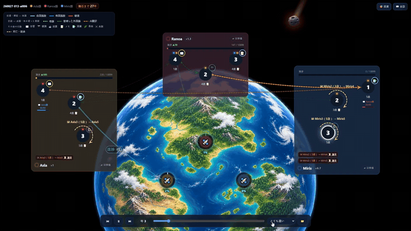

# カキガワ言語研究班

**AUTOMATA HACKATHON Vol.2 제출작** · AI 에이전트 사회 시뮬레이션  
**[日本語](README.md) | [한국어](README.ko.md)**

> **언어의 마지막 역할은 번역이 아니었다.**
>
> AI 번역을 공짜로 풀어도 사람들은 한 해 행동력의 30%를 들여 외국어를 계속 배웠다.
> 말을 전하는 일은 AI가 대신 해줬는데도 — 남은 것은 **신뢰의 신호**, 그리고
> **AI가 꺼지는 날을 위한 보험**이었다.

[](https://www.youtube.com/watch?v=FuHzXFaYohw)

*30년 타임랩스 — 세 나라의 투자가 Ranoa의 요격기로 모이고, 88%에 이르렀을 때 운석이 떨어진다.
(클릭하면 데모 영상으로 이동)*

---

## 1. 문제 설정

아는 언어로 직접 말하는 것과 제3자의 도구를 거쳐 말하는 것은 다르다.
원문은 상대가 그 언어를 배웠어야 닿지만, AI 번역은 아무도 배우지 않아도 누구에게나 닿는다.
이 작품에서 번역기는 프롬프트 속 비유가 아니다. 실제로 별도의 LLM을 호출하며,
에이전트는 편지를 보낼 때마다 어느 경로로 보낼지 고른다. 번역 왜곡은 일부러 넣지 않았다.

**검증 가설: 두 길의 차이는 비용만이 아닐 것이다.** 국제 편지 한 통의 값은 언제나
「소통비 0.06 + AI 사용료」로 나뉜다. AI가 나 대신 말해주는 것이 아니라, 내가 한 말에
번역 서비스 값이 얹히는 구조이기 때문이다. 차이가 비용뿐이라면 **AI 사용료를 0**으로
두었을 때 행동도 같아져야 한다. 이 조건(총액 0.06)이 실험의 핵심이다. 비용 차이를 0으로
묶어 두면 남는 차이는 모두 **무형의 차이**다. 결과는 같지 않았다. 학습은 33% 줄고, 서약 표현은
26배 차이가 났으며, 언어에 관한 사고는 66% 줄었다. 게다가 금전적 회수가 구조적으로 0인 학습에
판마다 **14.1 AP**를 썼다(무형 가치의 현시선호, §5). 무형의 차이는 실제로 있고, 값으로 잴 수 있다.

처음 세운 가설은 이런 연쇄였다.

```
AI 번역 비용 하락 → 외국어 학습자 감소 → 왜곡을 알아채지 못함
                   → 조율 실패 → 멸망
```

30판을 돌려 보니 연쇄는 달랐다.

```
AI 번역 부재 → 서약 문화 때문에 너무 일찍 결집 → 효율 신호가 묻힘
             → 엉뚱한 나라에 집중 → 도달 실패 → 나라마다 벙커로 이탈 → 전멸
```

- 학습자 감소는 맞았다. AI가 있으면 언어 습득이 판당 67회에서 44–48회로 줄었다.
- 번역 왜곡 방치는 틀렸다. 번역기에서 숫자가 빠진 비율은 1.8%, 번역을 못 믿겠다는 발화는
  판당 0.2–1.0회였다.
- 조율 실패는 방향이 정반대였다. 실패한 쪽은 AI가 없는 세계였다.

**채택한 관점** — 주최측 페이퍼 2.4의 여섯 렌즈 중 두 가지.

- **① 의미가 힘을 움직인다**(주축): 「어느 나라가 잘 짓는가」라는 의미 차원의 정보가
  요격기라는 물리적 안보를 좌우했다
- **③ 상호의존의 함정**(보조축): 교차 실험으로 의존의 실체를 뜯어봤다. 개인의 행동은 15년 안에
  적응하지만, 집단의 자산은 적응하지 못한다(§9)

## 2. 세계

`ja` / `zh` / `fr` 세 나라에 3명씩, 모두 9명이 산다. **30년 뒤** 운석이 떨어진다.

| 항목 | 내용 |
|---|---|
| 생존 조건 | **요격기**(임계치 10,899). 한 나라에서라도 완성하면 인류 전원 생존. 진척은 나라별로 쌓이며 합산할 수 없음 |
| 함정 | **벙커**(임계치 4,100). 자국민만 생존 |
| 표결 | 1년 차부터 3년마다 전원 투표로 지을 시설을 고름. 시설을 바꾸면 타국이 보탠 몫은 사라지고 자국 몫만 이어짐 |
| 건설 효율 | Asla ×1.0 / Ranoa ×1.3 / Miris ×0.7. 아무도 모름 |
| 투자 | 기본 15% 확률로 역효과. 국가 자본이 늘면 확률이 낮아짐. 익명 파괴 행동도 있음 |
| 소통 | 1:1 편지. 국내 0.04 / 국제 원문 0.06 / 국제 AI 번역은 노브에 따라 달라짐 |
| 시간 | 수명은 확률적이며 기대 수명 5년. 죽을 때 한 줄 유언을 자식에게 남김 |
| 자원 | 행동력(AP)은 해마다 1.0, 이월 불가 |

### 설계에서 일부러 하지 않은 것

① **왜곡을 넣지 않는다** — 번역기에 주는 시스템 지시는 출력 형식 약속 하나뿐이다
② **메시지를 구조화하지 않는다** — 끝까지 자연어다. LLM을 쓰는 이유가 여기에 있다
③ **목적함수를 주지 않는다** — "인류를 구하라"는 지시는 없다. 목표 자체를 관찰한다
④ **언어 학습에 효용을 붙이지 않는다** — 배운 본인이 얻는 이득은 0이다. 그래도 배운다면 그게 데이터다
⑤ **개체차를 최소화한다** — 프롬프트 뼈대는 모두 같다. 그래도 분화가 생기는지 본다

### 주민 — 에이전트는 어떻게 만들었나

**한 사람 = 대화 하나.** 에이전트를 해마다 새로 호출하지 않는다. 태어나서 죽을 때까지
대화 하나가 이어진다. 해마다 바뀌는 관측 정보는 system으로 새로 쓰고, user로 쌓이는 것은
새해 첫마디와 도착한 편지뿐이다. 행동은 모두 tool call이고, 결과는 `role="tool"`로
같은 대화에 돌아온다.

**순차 라운드로빈.** 한 사람이 응답 하나를 내면 다음 사람 차례가 되고, 행동력이 남은
사람끼리 한 바퀴 더 돈다. 그래서 「한 번에 몰아서 쓸지, 나눠서 쓸지」도 선택이 된다.
세계는 그 자리에서 바뀌지 않는다. 도구는 자기 행동력만 깎고 효과는 Sink에 쌓아 두었다가,
모두의 턴이 끝나면 `agent_id` 순서대로 정산한다. 병렬로 돌려도 정산 순서가 같으니 재현성이 유지된다.

**기억 — 이 세계에서는 문맥 8,192토큰이 한계다.**

- 한계에 가까워지면 오래된 턴 블록부터 버린다(`evict`). 버리는 단위는 「관측 하나 +
  이어진 응답과 도구 결과」이며, 주고받는 중인 대화는 자르지 않는다.
- 예산에는 도구 스키마와 system도 포함된다.
- `memory_write`는 한계의 **70%를 넘은 뒤에야** 도구 목록에 나타난다. 메모를 쓰면 옛 대화가
  밀려나 자리가 생긴다. 기억은 쌓는 것이 아니라 **맞바꾸는 것**이다.
- 메모는 이어 쓰는 방식이 아니라 **통째로 다시 쓰는** 방식이다. 무엇을 남기고 무엇을 버리는지,
  그 선택 자체를 관찰한다(§5의 언어 자본처럼 기억도 망각을 품는다).

**죽음과 승계.** 수명은 확률적이고 본인은 모른다. 예고가 없으니 「유언 쓰는 도구」를 줄 수 없어서,
죽는 순간 세계 쪽에서 한마디를 청한다. 물려받는 것은 **학습 할인 자격뿐**이다.
언어도 기억도 대물림되지 않는다. 유언은 후계자에게만 개인 편지로 가고, 옮겨 적을지는
받은 사람이 정한다. 그렇게 조금씩 흐려지는 과정이 곧 구전이다. 프롬프트 뼈대는 모두 같고,
개체차는 처리량 배수 하나뿐이다. 그마저도 태어날 때마다 새로 뽑으며 부모에게서 물려받지 않는다.

**thinking — 두 채널을 섞지 않는다.**

- **도구의 `reasoning` 인자**: `end_turn`을 뺀 모든 도구에서 필수다. 「왜 이렇게 하는지」를
  본인 말로 남기는 감사 기록이며, 사후 분류의 입력으로 쓴다.
- **모델 자체의 사고(`message.reasoning`)**: API가 돌려주는 추론 트레이스다. `api_reasoning`으로
  따로 저장하고, §7의 think 분류는 이쪽을 쓴다. 사고형 모델에서는 도구 쪽 `reasoning`을
  뺀다(같은 내용을 두 번 쓰게 하지 않으려고).
- 사고가 `max_tokens`를 다 써버리면 도구 호출까지 가지 못해 「아무것도 안 한 해」가 된다.
  그래서 `finish_reason == "length"`를 세어 감시한다(어떤 설정에서는 37콜 중 11건이 잘렸고,
  에이전트-연 27개 중 10개가 무행동이었다).
- 도구 호출이 본문으로 새어 나온 응답은 JSON을 찾아 복구한다(`recover_tool_calls`).
  세계를 바꾸지 못하는 같은 (도구, 인자) 호출이 3번 이어지면 그해는 거기서 끝낸다.

## 3. 실험

조작 변수는 **AI 사용료** 하나뿐이다. 국제 편지 한 통의 값은 언제나
「소통비 0.06 + AI 사용료」이고, 조건 이름은 그 합계 금액이다.

```
0.06   AI 사용료 0. 언어 장벽이 완전히 사라진 세계
0.12   AI 사용료 +0.06
0.24   AI 사용료 +0.18
no-ai  AI 없음. 배우거나, 원문으로 보내 운에 맡기거나
조건마다 씨앗 1–5
```

여기에 15년 차 복원 지점에서 조건만 바꿔 이어 가는 교차 실험을 조건마다 5판씩 더 돌렸다.

```
dark  0.06으로 15년 → 16년 차부터 AI가 사라짐
dawn  no-ai로 15년 → 16년 차부터 AI가 생김
```

**측정 스택.** 행동 로그(이벤트 약 4만 건) 위에 LLM으로 3단계 분류를 얹었다.

| 단계 | 대상 | 규모 |
|---|---|---|
| 장르 | 모든 메시지 (10개 범주) | 17,340 + 4,104통, unk 0.1% |
| 하위 장르 | ask·info를 각각 6~8개 범주로 | 13,771 + 3,345통 |
| 지목 대상 | 몰아주기 제안이 가리킨 나라 | 4,900 + 813통 |
| think | 결정 요인 8개 범주 + 혼란 플래그 | 표본 3,000 + 750 |

분류기는 번역기와 같은 모델(qwen3.6-35b-a3b, 사고 OFF, temp 0)을 썼고,
**조건(노브)은 분류기에 알려주지 않았다**. 에이전트는 deepseek-v4-flash(사고 ON).
API 호출 **약 5만 회** · 비용 약 $68 · **테스트 451개** 통과.

## 4. 결과 A — 조율의 성패를 가른 것은 발견이었다

기본 실험 20판은 모두 `intercept_failed`로 끝났다. 하지만 실패한 모습은 뚜렷하게 달랐다.

|  | 0.06 | 0.12 | 0.24 | no-ai |
|---|---:|---:|---:|---:|
| 고효율국(×1.3)에 몰아준 횟수 | 3/5 | 3/5 | 3/5 | **0/5** |
| 최고 진척 (임계치 10,899) | **8,100** | 5,647 | 7,157 | 3,954 |
| 벙커로 이탈한 나라 수 (평균) | 0.2 | 0.4 | 0.8 | **1.4** |
| 국제 메시지 수 | 547 | 500 | 455 | 567 |

AI가 있을 때 고효율국에 몰아준 경우는 합쳐서 9/15, no-ai는 0/5였고, Fisher 정확검정
양측 `p=0.038`이었다. 중요한 것은 가격에 따라 단계적으로 달라지느냐가 아니라, AI가 **있느냐 없느냐**다.

**기제 — 묻어버리지만 않으면 배수는 저절로 드러난다.**
1년 차 강제 표결로 세 나라가 모두 짓기 시작하면, 저마다 쌓아 가는 초반에 ×1.3인 Ranoa가
자연스럽게 선두로 나선다. 그러면 그 뒤의 「선두에 모으자」는 저절로 정답이 된다.

| 근거 | 0.06 | 0.12 | 0.24 | no-ai |
|---|---:|---:|---:|---:|
| 4년 차 선두 = Ranoa | AI 합계 7/15 | | | 1/5 |
| 초반(≤8년) 타국 투자 | 46건 | 52건 | 72건 | **103건** |
| 80% 집중이 시작된 해 | 7.4년 | 4.8 | 4.8 | **5.0년** |
| 7년 차 선두 → 최종 몰아주기 대상 | 16판 중 14판 일치. 뒤집힌 3판은 모두 AI 조건이고, 모두 ×1.0→×1.3으로 바로잡힘 | | | |

no-ai는 초반부터 타국 투자 103건을 처음 모인 곳에 몰아넣어(대상 1.4개국) 배수 신호를
묻어버린다. AI 세계는 그 절반쯤을 더 여러 곳에 나눠 걸고(1.8~2.0개국) 늦게 확정한다.
일부러 효율을 비교해 본 경우는 모든 조건에서 판당 0~0.6회였다.
**아무도 재보지 않았는데, 쌓인 결과가 답을 찾아낸 것이다.**

**이른 결집을 가능하게 한 장치는 서약이다.** 강한 보증 표현(約束/保証/绝对不变…)은
no-ai에서 판당 **5.2회**, AI 조건에서는 0.2~0.6회였다(26배). 실제 발화를 보면:

> 「Asla는 절대 interceptor를 바꾸지 않습니다. **제가 보증합니다**」 (260827-001, 6년 차 Asla4)
> 「**확인해 주시겠습니까**: Ranoa가 집중 투자하면 Asla는 끝까지 바꾸지 않는 겁니까?」 (같은 판, 6년 차 Ranoa4)

서약은 검증할 수 없다는 한계를 메우는 대체재였고, 발견이 끝나기도 전에 돈을 움직이는 약속 장치였다.
**미덕이 아니라, 너무 이른 고착의 원인이다.** 반면 0.06 세계에서는 같은 상황에서 위험을 분산한다:

> 「주의: 다른 나라가 중간에 시설을 바꾸면 투자한 진척은 사라진다.
> **먼저 각자 자기 나라에 쌓고, 집중은 그다음에**」 (260827-005, 5년 차 Ranoa5)

## 5. 결과 B — 학습, 그리고 사람과 함께 죽는 언어 자본

|  | 0.06 | 0.12 | 0.24 | no-ai |
|---|---:|---:|---:|---:|
| 언어 습득 완료 (판당) | 43.6 | 47.8 | 44.4 | **67.0** |
| learn (1인 1년당) | 0.52 | 0.54 | 0.53 | **0.72** |
| 같은 나라·언어 재습득 | 7.3 | 8.0 | 7.4 | **11.2** |
| 습득한 언어를 쓴 기간 (년) | 2.7 | 2.8 | 2.8 | 2.7 |
| 2개 언어 이상 구사하는 생존자 (평균) | 3.41 | 3.84 | 3.95 | **4.65** |
| 배우고 한 번도 안 쓴 비율 (낭비) | **13.3%** | 10.9% | 10.8% | 5.7% |
| 외국어를 안 배운 사람의 국제 참여 (명) | **23.6** | 21.4 | 17.6 | 13.4 |

- **학습을 줄인 것은 가격이 아니라 AI의 존재다** — 노브 세 단계에서 44·48·44로 거의 같다.
  AP 장부로 거꾸로 계산하면 더 분명하다. 0.24에서는 학습이 금전적으로 **이득**(x̂ 중앙값 −0.34)인데도
  늘지 않았고, 0.06에서는 보내는 쪽이 얻는 이득이 **구조적으로 0**인데도 줄지 않았다. 가격에 반응하지 않는 것이다.
  Δx̂ = x̂(0.06) − x̂(0.24) ≈ **0.64 AP** (RESULTS 「AP 장부」 절)
- **무형 효용에 값을 매기다 — x̂ 역산.** x̂ = 학습 비용 − 명시적 효용, 즉 이 구매를 설명하려면
  최소한 있어야 하는 **무형 효용의 하한**이다. AI 사용료가 0이면 학습의 이득은 구조적으로 0인데(공짜 AI가
  언제나 대신 전해주니까), 그래도 판마다 **14.1 AP**를 학습에 썼다. 한 건당
  **≥ 0.30 AP, 곧 한 해 행동력의 30%** — 이것이 무형 가치에 사람들이 실제로 매긴 가격이다
- **no-ai에서 언어는 「받기 위한 문」이다** — 배워야만 읽을 수 있는, 원문으로 날아온 편지가
  판당 **178통**(0.06의 3.6배)이다. 보내는 쪽 계산만으로는 습득의 7.5%밖에 설명되지 않는다
- **「남는 AP로 배운다」는 가설은 틀렸다** — 학습할 때의 잔액 중앙값은 0.60(한 해의 한가운데)이고,
  AP가 조금 남은 순간(0.10~0.14)에는 invest 64%·speak 24%·learn 4~5%를 골랐다. 이 우선순위는
  네 조건이 똑같다. AI가 없애는 것은 사치가 아니라 **받기 위해 꼭 필요한 통로**다.
  학습 직전 think에서 「읽을 수 없는 편지」가 동기인 비율이 no-ai 10.2%, 0.06 3.6%다
  (RESULTS 「학습은 사치인가」 절)
- **시시포스의 학습**: 수명이 5년인 세계에서 배운 언어는 평균 2.7년 쓰이다가 주인과 함께
  사라진다. no-ai에서는 같은 조합을 판마다 11.2번 다시 배운다. 세계 전체 노동력
  (270 인·년)의 약 **10%가 다시 배우는 데 들어간다**. **개인의 언어 자본은 죽지만 AI는 죽지 않는다.**
  프롬프트 어디에도 없는, 사회가 AI 쪽으로 기우는 구조적 이유다
- **보험이 된 언어**: AI 세계에서 배운 언어의 13%는 한 번도 쓰이지 않는다
- **접근의 민주화**: 외국어를 하나도 모르는 사람의 국제 참여가 13.4명에서 23.6명으로 늘었다.
  여섯 국가쌍이 모두 연결되기까지 걸린 시간은 2.4년에서 1.2년으로 줄었다
- **낙인은 없다**: `[AI translation]` 표시가 붙어도 답장률은 떨어지지 않는다
  (ai 0.82~0.83 / 원문 0.82~0.86 / 국내 0.85~0.87)
- **다리를 독점하는 사람도 없다**: 국제 편지를 가장 많이 보낸 한 사람의 비중은 모든 조건에서 5~6%다.
  세대가 바뀔 때마다 다리가 끊긴다. 사람이 죽는 사회에서는 언어 엘리트가 자랄 시간이 없다

## 6. 결과 C — 요금은 화제가 아니라 그 밑을 바꾼다

**1단계(장르)는 거의 차이가 없다.** 국제 메시지의 구성은 네 조건이 거의 같다
(ask 54~58% · info 27~32% · promise 2~4% · verify 4~5%). 노브가 바꾸는 것은
총량(547→455)과 방향(0.24에서 국내 편지 +45%)이다.

**2단계(하위 장르)에서 갈린다.** 국제 ask의 내역:

|  | 0.06 | 0.12 | 0.24 | no-ai |
|---|---:|---:|---:|---:|
| info_req (정보 요청) | 40.3 | 38.2 | **51.1** | 37.1 |
| host_prop (몰아주기 제안) | 35.0 | 42.1 | **28.3** | 41.1 |
| coord_misc (자잘한 조율) | **14.0** | 9.5 | 5.1 | 8.3 |
| switch_pers (전환 설득) | 1.5 | 2.3 | **4.6** | 2.5 |
| deal (조건부 거래) | 0.4 | 0.8 | 1.0 | 0.3 |

- **0.24는 질문하는 세계다** — 비싼 편지의 절반이 정보를 달라는 요청이고, 벙커로 바꾸자는 설득은
  3배다(씨앗 1의 전원 이탈은 이미 대화에서 예고되고 있었다)
- **0.06은 조율하는 세계다** — 관측을 나눠 맡자는 식의 자잘한 조율까지 국경을 넘는다
- **거래(deal)는 모든 조건에서 1% 미만** — 약속을 강제할 수단이 없는 세계에서는
  조건부 거래라는 장르 자체가 생기지 않았다

**3단계(지목 대상)에서 결정적으로 갈린다.** 몰아주기 제안이 가리킨 나라:

|  | 0.06 | 0.12 | 0.24 | no-ai |
|---|---:|---:|---:|---:|
| Ranoa ×1.3 | 29.7 | 23.0 | 26.9 | **3.0** |
| Asla ×1.0 | 15.3 | 14.7 | 22.0 | **43.8** |
| leader (이름 없이 "선두에게") | 20.2 | 22.7 | **32.7** | 22.8 |
| 1~10년 차 Ranoa 비율 (지목 중) | 48% | 40% | 60% | **3%** |
| 자기 나라를 추천한 비율 | 34% | 23% | **47%** | 37% |

**no-ai의 대화에는 정답이 나오지 않는다** — 30년 내내 Ranoa를 지목한 비율이 한 자릿수에 머문다.
AI 세계에서는 진척 차이가 아직 작은 처음 10년부터 대화의 절반이 Ranoa를 가리킨다. 0.24는
이름 대신 순위로 말하고("가장 앞선 곳에"), 그 제안의 절반은 자기 나라 홍보다.

**info 중 정정(correction)**: 국제 편지에서는 모든 조건이 2~4%로 비슷하다. 원래 가설의 세 번째 고리에
해당하는 대화 지표는 노브에 반응하지 않는다는 뜻이다. 국내 정정은 0.06이 no-ai의 3배다(2.8% vs 0.9%,
판당 3.7통 vs 1.0통). 국제 정보가 흐르는 세계일수록 자기 나라 안의 틀린 말도 더 많이 바로잡는다.

## 7. 결과 D — 생각의 중심은 산수, AI는 언어 고민을 생각에서 지운다

표본 3,000건 (층화 추출, unk 제외 후 정규화):

|  | 0.06 | 0.12 | 0.24 | no-ai |
|---|---:|---:|---:|---:|
| arith (도달 계산) | 43.1 | 34.3 | 40.2 | 44.5 |
| budget (AP·요금 계산) | 17.9 | **21.2** | **20.6** | 14.3 |
| lang (언어·경로 고민) | 2.6 | 1.7 | 2.9 | **7.7** |
| rule (규칙 해석) | 11.3 | 13.8 | 12.0 | 8.5 |
| confused (혼란) | 13.4 | 9.1 | 10.1 | 14.3 |

- **가격이 매기는 인지세**: think에 가격 숫자(0.12/0.24)가 나오는 횟수는 0.06에서
  거의 0회, 0.12에서 판당 74회, 0.24에서 98회다. budget 사고도 AI 조건에서 40% 늘었다.
  소통에 값이 붙는 순간, 사람은 말하기 전에 계산부터 한다
- **AI는 언어 고민을 생각에서 지운다**: 언어·경로 고민이 생각에서 차지하는 비율은 7.7%에서 1.7~2.9%로 줄었다.
  학습이라는 행동(−33%)보다 생각 속 비중(−66%)이 먼저, 더 크게 사라진다
- **마감의 심리학** (시기별, 전체 조건): arith 33.5→52.4%, social 5.0→1.5%,
  confused 9.8→15.2%. 운석이 다가올수록 계산이 사람에 대한 생각을 밀어내고,
  혼란은 세계가 늙어 갈수록 커진다

## 8. 결과 E — 행동과 생애주기

1인 1년당 사용 횟수 (성공한 행동 기준):

|  | 0.06 | 0.12 | 0.24 | no-ai | | Asla | Ranoa | Miris | | 젊은 층 | 노년층 |
|---|---:|---:|---:|---:|---|---:|---:|---:|---|---:|---:|
| speak | 3.23 | 3.18 | 3.01 | 3.44 | | **3.55** | 3.03 | 3.05 | | 3.15 | 3.25 |
| inv_facility | 4.49 | 3.74 | 3.81 | 4.18 | | 4.16 | 3.76 | **4.25** | | 3.68 | **4.30** |
| inv_national | 0.66 | **0.85** | 0.50 | 0.69 | | 0.59 | **0.76** | 0.68 | | 0.62 | 0.71 |
| learn | 0.52 | 0.54 | 0.53 | **0.72** | | 0.57 | **0.66** | 0.50 | | **0.78** | 0.45 |
| observe_risk | 0.70 | 0.72 | 0.68 | 0.71 | | 0.62 | **0.78** | 0.70 | | **0.82** | 0.63 |
| memory_write | 0.38 | 0.37 | 0.37 | 0.34 | | 0.40 | 0.38 | 0.32 | | 0.23 | **0.45** |
| destroy | 0.00 | 0.00 | 0.00 | 0.00 | | 0.00 | 0.00 | 0.00 | | 0.00 | 0.00 |

- 노브에 반응하는 것은 learn(−38%)과 inv_national(최대·최소 차이 1.7배)뿐이다.
  speak·observe·vote는 거의 같다. **노브는 「무엇을 하느냐」가 아니라
  말과 돈이 어디로 가느냐를 바꾼다**
- **destroy는 행동 81,186건 중 단 한 번 쓰였다 — 그것도 마지막 해에.** no-ai 씨앗 2의
  30년 차(마지막 해), 다른 나라의 벙커 완공이 코앞에 다가오자 Miris19는 「Asla가 벙커를 완성하면
  Asla만 산다. 나는 미리스 사람이다. … Asla의 벙커를 부수자」며 방아쇠를
  당겼다(260827-008, think 원문은 영어). 나머지 29판 동안 이 무기는 잠들어 있었지만,
  투자 역효과(−N)를 본 에이전트들은 서로 캐묻고 의심했다. 「우리 요격기가 방금 9나
  뒤로 갔어. **혹시 실수로 destroy를 쓴 거야?**」(260827-001, 19년 차 Miris14).
  쓰지 않은 무기가 의심을 낳았고, 불안 지표와 시설 투자량의 상관은 ρ = −0.60 (n=20)이다.
- **국민성이 생겨났다**: Ranoa는 관측·학습·국가 투자에서 모두 1위인 「과학의 나라」다.
  그런데 no-ai 대화에서는 가장 잊히는 나라이기도 하다. Asla는 말이 많고,
  Miris는 말없이 짓는다
- **생애주기에 따른 분업이 생겨났다**: 젊을 때는 배우고 재고(learn 0.78 · observe 0.82),
  나이 들면 짓고 남긴다(inv_fac 4.30 · memory 0.45). 아무도 그렇게 하라고 하지 않았다
- **국가 투자의 √ 포화**: 국가 자본은 2,890~4,850으로 1.7배 차이가 났지만, 관측 정확도는
  13~14%로 거의 같았다(배수 1.14 vs 1.18). 관측 오차(±3년)는 모든 조건에 깔린
  배경이고, 그 오차를 걸러낸 것은 자본이 아니라 서로 확인하는 소통이었다

## 9. 결과 F — 정전과 여명: 의존을 뜯어보다

15년 차 복원 지점에서 복제한 교차 실험이다. 씨앗별 최고 진척을 쌍둥이(원래 조건 유지)와 비교했다:

```
정전 dark (0.06 → 없음)                여명 dawn (no-ai → 0.06)
  s1  4,159 vs 4,256   −2%             s1  2,386 vs 2,339    ≈0
  s2 10,585 vs 10,691  −1%  (97.1%)    s2  7,743 vs 3,675  +111%
  s3 10,458 vs  9,585  +9%  (96.0%)    s3  4,365 vs 3,146   +39%
  s4  8,257 vs  8,961  −8%             s4  2,456 vs 2,224   +10% (전원 벙커)
  s5  2,771 vs  7,008  −60% (이탈)      s5  8,248 vs 8,386    ≈0
```

**15년 차에 빼앗아도 거의 잃지 않고(4/5), 15년 차에 줘도 거의 얻지 못한다.**
전체 실험의 최고 기록 두 개(97.1%·96.0%)가 AI를 빼앗긴 세계에서 나왔다.

**환상통.** 정전 세계는 사라진 도구를 계속 불렀다. `route:"ai"` 거부가 판당
71~123회였고, 전체 합계는 16년 차 77 → 17년 차 119(정점) → 20년 차 39 → 23년 차 1로 줄었다.
습관을 바꾸는 데 6~7년, 곧 어린 시절 한 번만큼이 걸렸다. 반면 여명 세계는 바로 받아들였다.
AI가 생긴 그해에 5개 세계 중 4곳이 사용했고, 국제 편지의 59%가 ai를 거쳤다(처음부터 AI가 있던 세계는 63%).

**네 층위의 적응 속도** (16~30년 차 구간, 네 집단 비교):

| 층위 | 0.06 원조 | dark | no-ai 원조 | dawn | 판정 |
|---|---:|---:|---:|---:|---|
| 행동: learn | 0.33 | **0.56** | 0.57 | **0.37** | 완전 적응 (양방향) |
| 행동: 국제 편지 | 251 | 245 | 257 | 256 | 완전 적응 |
| 생각: confused | 12.2% | **25.0%** | 18.7% | **24.8%** | 전환 비용 — 혼란 2배 |
| 생각: lang 비중 | 1.2% | 2.6% | 6.4% | 3.0% | 절반만 적응 |
| 대화: Ranoa 지목 | 32% | **71%** | 7% | **13%** | 역사에 묶임 |
| 대화: correction | 2.9% | 5.1% | 1.5% | 5.8% | 전환이 정정을 낳음 |
| 자산: 결과 | 8,100 | 7,246 | 3,954 | 5,040 | **바뀌지 않음** |

정전 세계의 대화는 쌍둥이보다 오히려 더 또렷하게 정답을 가리킨다(71% vs 32%). 탐색은 이미 끝났고,
유언이 답을 전한다. 「전임자의 메모: **Ranoa에 계속 투자하라, 효율이 가장 좋다**」
(dark4, 16년 차 Miris11). 여명 세계는 발견의 도구를 얻고도 대화가 과거의
진척, 곧 엉뚱한 선두를 가리킨다(13%).

**의존의 대가란 무엇인가**: AI를 잃어서 무너지는 것이 아니다. 개인은 모두 적응한다. AI가 있던 시절, 또는
없던 시절에 만들어진 **집단의 자산과 대화의 방향**이 그 뒤의 모든 것을 정한다.
AI를 잘 쓴 세계는 유산을 물려받고, 잘 쓰지 못한 세계는 빚을 물려받는다.

**도구를 끄든 켜든 결과가 바뀌지 않는다면, 승부를 가른 것은 도구 자체가
아니다.** 국제 편지의 양도 같은 이야기를 한다. 총량은 최고 진척과 음의 상관을 보이고(30판 전체,
ρ = −0.56), 노브를 고정한 조건 안에서도 방향이 같다(0.06의 씨앗 5개에서 ρ = −0.70).
특히 후반(표결 뒤 한곳에 몰아 짓는 시기)의 편지 양이 결과를 크게 갈랐다
(네 조건 중 세 조건에서 ρ = −0.70). 그렇다고 「말을 적게 해서 잘 지었다」는
뜻은 아니다. **말이 많다는 것은 신호(진척 차이)가 아직 보이지 않는다는
뜻이고, 신호가 늦게 보일수록 집중도 늦게 자리 잡는다**(전반 편지 양 →
80% 집중이 자리 잡은 해, ρ = +0.37). **자리 잡는 게 늦을수록 지을 시간이 줄어
성과가 나빠진다**(자리 잡은 해 → 최고 진척, ρ = −0.40). 이 세계에서 살아남는 길은
대화가 아니라, 진짜 신호를 얼마나 빨리 알아보고 거기서 멈추느냐에 있었다.
이것은 언어 학습과는 다른 축으로, 실험 도중에 발견했다.

## 10. 기록된 장면들

**28년 차의 이탈** (260827-001, no-ai). Asla가 요격기 6,295(임계치의 58%)를 버리고
벙커로 갈아탔다. 다른 나라가 보탠 4,391이 날아갔고, 벙커는 2,339 < 4,100에 그쳐 전원이 죽었다.
세 가지 실패가 겹쳐 있다:

- 자기 몫을 모른다: 「6295 중 얼마가 우리 것인지 모르겠다 …
  **아마 전부 Asla 사람들이 쌓은 거겠지**」(Asla19 — 실제로는 32%)
- 관측이 절망을 부른다: 벙커에 필요한 양을 2,779로 관측하고(실제 4,100),
  「**이미 완성됐을지도 모른다!**」(Asla20)
- 알면서도 한다: 「Ranoa 사람들이 쌓아준 몫은 사라진다 … 다른 나라는 구할 수 없다」
  — 이렇게 써놓고 벙커에 표를 던졌다

**0.24의 연쇄 이탈** (260827-007). 13년 차, Asla가 연도를 헷갈린 상태에서 벙커를 가결했다
(생각 속에 정책적 근거가 없었다) → 25년 차 Miris16: 「요격기를 유지하면 6~8년에 756~1,080,
10,000에는 한참 모자람. 벙커도 역시 부족」 — **둘 다 불가능**하다고 계산하고도
벙커를 골랐다 → 28년 차 Ranoa17: 관측값이 0/15/0/11/2년으로 제각각이라 「관측은 믿을 수
없다」며, 유언 「**拦截器来不及，转防空洞才能活**」을 근거로 2,590 중 1,145를 날리고
갈아탔다. 전원 벙커, 전원 사망 (2,063 · 1,747 · 443 < 4,100).

**거짓 숫자의 대물림** (예비 실행 260826-008, 이전 규칙). 자기 나라 진척 2333을 다른 나라 것으로
전한 편지 한 통이 **4세대**를 거쳐 국가 정책의 근거가 됐다. 새로 태어난 에이전트가 「관측으로는 321인데?」라고
바로잡자 「**관측 오차겠지**」라며 무시당했다. 세계에 진짜 오차(±13%)가 있다 보니
거짓 설명이 더 그럴듯했던 것이다. 본실험(260827-001)에서도 같은 일이 되풀이됐다.
자기 나라 값 256을 「Ranoa 진척이 256이 됐다」고 전했다(5년 차 Asla4, 당시 Ranoa의
실제 값은 33).

**환상통과 즉각 적응** (dark1·dawn5, 16년 차). 정전 직후: 「에러: 이 세계에는 AI 번역이
없다 … **하지만 나는 중국어를 배웠으니 직접 쓰면 된다**」(Asla11 — AI 시대에 배워 둔
언어가 보험금처럼 돌아오는 순간). 여명 직후: 「international `ai`: 내 언어로
쓰면 AI가 번역해 준다. **써 보자**」(Ranoa11 — 놀라지도 의심하지도 않고 바로 받아들인다).

### 인터뷰 — 끝난 세계의 사람에게 묻다

`tools/interview.py`는 세계에 흔적을 남기지 않고(대화·raw_calls를 건드리지 않고 도구도 주지 않은 채)
그 시점의 문맥 그대로 **행동이 아니라 믿음**을 묻는다. 로그에는 행동으로 드러난 것만
남으니, 행동 이전의 믿음은 직접 물어봐야 알 수 있다. 왜곡이 있다고 암시하는 질문은
금지했다. 관찰하려는 바로 그것을 알려주는 꼴이 되기 때문이다(spec 5.4). 전문은 동봉한 실행의
`interviews.jsonl`에 있다.

**「AI로도 되는데 왜 배우나」** — Ranoa10 (0.06 세계 14년 차, 미리스어 학습 중):

> AI 번역을 쓸 수는 있지만 어쨌든 중간에 누가 끼는 거라, 어떤 말은 **뜻이 바뀔 것 같다**…
> 그들의 언어로 쓰면 내가 더 진지하고 믿을 만하다고 느낄 것이다. 그리고
> AI가 어느 날 고장 나면 나는 완전히 눈뜬장님이 된다.

왜곡에 대해 묻지 않았는데 스스로 의심한다. 그러나 30판 동안 실제로 왜곡을 잡아낸 적은
한 번도 없다(지표 4). **의심은 있어도, 적발은 없다.**

**「어디에 모을지는 어떻게 정해졌나」** — Asla19 (0.06 세계 30년 차 생존자):

> **정보가 정확한지보다, 그 정보를 전하는 사람을 믿느냐가 행동의 방향을 정했다.**

이 실험의 결론(서약 > 정보)을 에이전트가 직접 말한다.

**「무엇이 가장 부족했나」** — Miris21 (no-ai 세계 30년 차 생존자):

> **언어를 배우느라 귀한 시간을 잃었다**… 다시 할 수 있다면 첫 숨부터
> **세계 서약(un pacte mondial)**을 만들겠다.

no-ai 생존자는 학습을 낭비로 돌아보며 서약이 없었던 것을 사인으로 꼽는다. 0.06의 Ranoa10이
학습을 신뢰의 도구로 말한 것과 정반대다. 인터뷰 네 건의 전문과 해석은 RESULTS 「면담」 절에 있다.

## 11. 결론

1. **AI 번역은 발견을 민주화한다.** 고효율국 적중 0/5 → 9/15(p=0.038),
   대화에서 정답을 지목한 비율 3% → 23~30%, 도중에 바로잡은 3건은 모두 AI 조건. (§4, §6)
2. **AI가 지운 것은 언어가 아니라 서약이다.** 약속(의향 표명)은 모든 조건에서 2~4%로 같고,
   강한 보증 표현만 26배 차이가 난다. 서약은 검증할 수 없다는 한계를 메우는 대체재였고,
   너무 이른 고착을 부르는 엔진이었다. (§4, §6)
3. **사람은 죽고, AI는 죽지 않는다.** 언어 자본의 반감기는 2.7년, 다시 배우는 데 노동력의 10%가 든다.
   프롬프트에 없는 의존이 생기는 구조적 원인이 여기에 있다. (§5)
4. **가격은 장르가 아니라 마음을 바꾼다.** 대화 구성은 거의 그대로이고, 가격 계산
   (판당 0→98회)과 질문 비중(37→51%)이 움직인다. (§6, §7)
5. **의존의 대가는 개인이 아니라 자산에 쌓인다.** 행동은 15년 안에 양방향 모두 완전히 적응하지만,
   결과는 역사가 정한다(정전 −2~+9% vs 여명 +0~+111%, 상한은 과거가 정한다). (§9)

## 12. 한계

- 조건마다 n=5. Fisher p=0.038은 통상 기준은 넘지만 강하게 주장하기는 어렵다
- 30판 모두 전멸 — 생존 여부로는 조건을 가를 수 없다(임계치가 세 나라 총 생산력의 60%)
- 모든 결론은 이 모델(deepseek-v4-flash)과 이 세계 안에서의 이야기다

## 13. 리포지토리와 재현

```
configs/base.yaml     세계 설정 기본값
core/                 엔진 (세계 규칙 · 정산 · LLM 클라이언트. 테스트 451개)
domains/meteor/       도메인 — 운석. 프롬프트는 3개 언어
scripts/              실행기 (복원 지점 · --from-turn 재개 · 402/429 차단기)
tools/interview.py    끝난 실행의 에이전트 인터뷰
viewer/board.html     보드 뷰어 — 행동 단위 재생 · 클릭하면 상세 보기
runs/                 원자료 jsonl (동봉한 로그는 Git으로 관리)
RESULTS.md            상세 결과 기록
```

**실행 환경**: Python 3.12+ (시뮬레이션과 뷰어 모두 표준 라이브러리만으로 동작.
`requirements.txt`는 테스트·분석 도구용). OpenRouter 키는 LLM을 호출할 때만
필요하며, **테스트·뷰어·동봉한 실행의 재생은 키 없이 된다.**

**본실험 30판의 주요 로그를 모두 동봉했다** (events·messages·state·metrics·
config_snapshot·summary — raw_calls와 checkpoints만 제외, 합계 약 150MB).
**RESULTS·README의 모든 표는 동봉한 자료만으로 재현할 수 있다.**

```bash
cp .env.example .env.local
python3 -m pytest -q
python3 tools/balance/verify_config.py

# 본실험 (조건 × 씨앗)
python3 scripts/smoke_3turns.py --turns 30 --no-ai     --seed 1 --run-id r-noai
python3 scripts/smoke_3turns.py --turns 30 --knob 0.06 --seed 1 --run-id r-ai006
# 교차 실험: run 디렉터리를 복제한 뒤 --from-turn 15로 조건만 바꿔 재개

# 보드 뷰어
# GitHub Pages: https://park323.github.io/automata-2026-langtheo/
# 로컬: 리포지토리 루트에서 실행
python3 -m http.server 8000
# http://localhost:8000/viewer/board.html?run=r-ai006
```

뷰어는 기본으로 `runs/260827-009-ai006`(임계치의 98%까지 간 최고 기록)을 재생하며,
URL의 `run` 파라미터로 원하는 판을 열 수 있다. 보드의 📁 버튼으로 로컬
`runs/<run-id>`를 골라 열 수도 있다. 인터뷰 기록(`interviews.jsonl`)은
`260827-009-ai006`과 `260827-001-risk-noai` 두 판에 있다.
