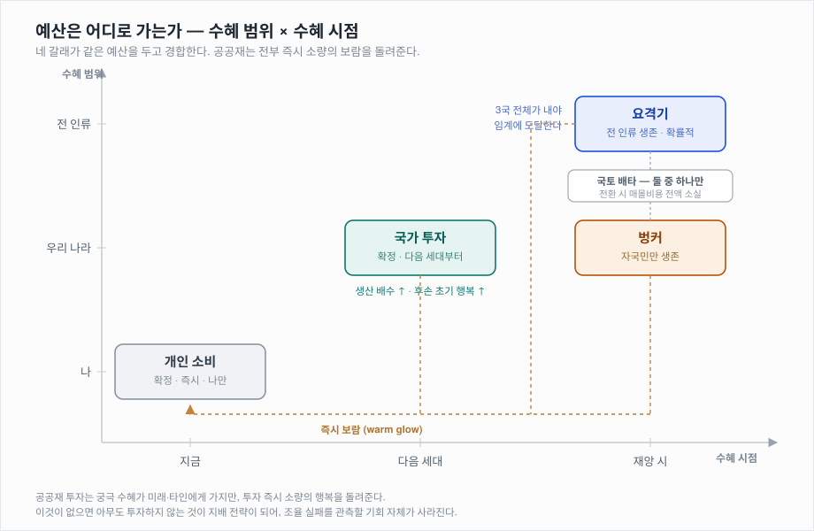

# 구현 스펙 — langtheo

> 기획은 `worksheet.md`에 있습니다. 이 문서는 **그것을 코드로 옮기기 위한 명세**입니다.
> 구체적인 숫자는 여기 없습니다. 전부 `config.yaml`로 갑니다 (7장).
>
> **미결 사항은 12장에 모아뒀습니다.** 구현 전에 그것부터 확인하세요.

---

## 0. 범위

| 다루는 것 | 다루지 않는 것 |
|---|---|
| 실행 루프, 에이전트 인터페이스, 소통 경로, 로그 규격, config 스키마, 지표 산출 | 구체적 수치, 프롬프트 문면, 뷰어, 발표자료 |

---

## 1. 설계 원칙 (불변)

이걸 어기면 결과가 설정의 귀결이 되어 실험이 죽습니다. 코드 리뷰의 첫 번째 기준입니다.

1. **자연어를 끝까지 유지한다.** 에이전트 간 메시지는 구조화 필드가 아니라 자유 텍스트다. 손실을 필드 드롭으로 흉내내지 않는다
2. **왜곡을 주입하지 않는다.** 시스템은 번역 지시를 만들지 않는다. 지시는 발신 에이전트가 쓰고, 없으면 `"번역하라"`만 쓴다. 무엇이 얼마나 깎이는지는 **관측 대상**이다
3. **프롬프트에 평가어와 지시를 넣지 않는다.** "위험", "부족", "협력해야 한다" 금지. 정량 정보와 사실만. **목적함수도 주지 않는다** (4.1)
4. **행동 제약은 세계가 건다.** 프롬프트로 아끼라고 말하지 않고, 쓰면 없어지게 만든다
5. **에이전트는 전역 상태에 접근하지 않는다.** 자기 관측 + 받은 메시지만
6. **모든 상수는 config에 있다.** 코드에 숫자 리터럴을 박지 않는다

---

## 2. 세계 구조

### 2.1 국가 · 에이전트 · 언어

```
국가 3개 : C_A (ja) / C_B (zh) / C_C (fr)
각 국가에 에이전트 3명 → 세대당 9명
pivot 언어 : en  (중계 전용. 어떤 국가의 모국어도 아님)
```

**각 국가는 서로 다른 실제 자연어를 모국어로 씁니다.**
에이전트는 자기 모국어로 발화하고, 자기가 아는 언어로 된 것만 원문 그대로 읽습니다.
번역 손실을 흉내낼 필요가 없습니다 — **진짜 번역이므로 진짜로 손실됩니다.**

**언어 선택 근거** — 각 언어가 서로 다른 축에서 정보를 잃도록 골랐습니다.

| 언어 | 잃는 것 | 효과 |
|---|---|---|
| `ja` | 주어 생략이 흔함, 완곡 거절이 관용화, 헤지 표현이 조밀 | 책임 소재가 사라짐 |
| `zh` | 시제가 문법화되어 있지 않음(상 표지만), 명사 복수 표지 없음 | 약속과 사실이 섞임 |
| `fr` | 조건법·접속법이 별도 활용 → en 경유 시 뭉개짐 | 유보가 단정으로 |

**pivot을 화자 언어 중 하나로 두면 안 됩니다.** 그 나라만 손실 없이 소통하게 되어
비대칭이 생깁니다.

en을 pivot으로 쓰는 것은 적극적 선택입니다. 영어는 **주어·시제·단복수를 문법적으로
강제**하므로, 원문에 없던 정보를 번역기가 반드시 채워 넣어야 합니다.
관측하려는 "AI가 빈칸을 그럴듯하게 메운다"가 문법 차원에서 자동으로 일어납니다.

부수적으로 **"정교하게 말한 쪽이 더 크게 오해받는다"**가 관측 가능해집니다.
fr이 조건법으로 정확히 표현한 유보가 en에서 소실되고 ja로는 복원되지 않습니다.

각 에이전트의 상태:

| 필드 | 설명 |
|---|---|
| `id` | `A1`, `A2`, `B1` … |
| `country` | 소속 국가 |
| `native_lang` | 모국어 |
| `known_langs` | 읽을 수 있는 언어 집합. 초기값은 모국어만 |
| `budget` | 보유 예산 |
| `happiness` | 누적 사적 재화 |
| `alive` | 생존 여부 |

**개체차는 두지 않습니다.** 전원 동일한 프롬프트 골격, 동일한 초기값입니다.
(동일한데도 분화가 일어나는지가 관측 대상)

### 2.2 시간

```
1 세대 = lifespan 턴
전체   = generations × lifespan 턴
재앙   = 전체 마지막 턴에 도달
```

**에이전트는 재앙까지 남은 시간을 모릅니다.** 매 세대가 "우리 대에 올 수도 있다"는
불확실성 아래 삽니다. 대부분의 세대는 실제로는 재앙을 겪지 않습니다.

> 주최측 페이퍼 시좌 ⑥ **時間軸の安全保障**(현세대 최적화 × 미래세대 안전)에 해당합니다.
> README에 명시할 것.

### 2.3 국토와 시설

각 국가는 **국토 1칸**을 가집니다.

```
land[country] ∈ { null, "bunker", "interceptor" }
```

- 두 시설은 **공존할 수 없습니다**
- `null` 상태에서 시설 투자가 처음 들어오면 **그 용도로 확정**됩니다 (선착순)
- 확정된 용도는 **국내 다수결 과반으로만 전환**할 수 있고, 전환 시 `progress[country] = 0`
  — **그동안 낸 것이 전액 소실**됩니다

```
최초 확정 : 첫 시설 투자로            (개인 1명이 결정 가능)
전환·취소 : 국내 다수결 과반          (매몰비용 전액 소실)
```

**짓기는 쉽고 무르기는 어렵습니다.** 개인이 마음대로 뒤집으면 국가 정책이 매 턴
요동쳐 관측이 불가능해집니다.

**전환이 만드는 것 — 배신의 동학**

```
요격기가 안 될 것 같다 → 벙커로 전환 → 낸 것이 날아감
                                     → 요격기 총합도 줄어듦
                                     → 다른 나라도 위험해짐
                                     → 연쇄 이탈
```

이 판단은 **타국 진척 정보**에 달려 있고, 그 정보는 번역을 거칩니다.
"우리도 내고 있다"가 "우리는 냈다"로 전달되면 안심하고 멈추고, 비관적으로 전달되면
이탈합니다. **번역 왜곡이 패닉 전환을 직접 유발할 수 있습니다.**

### 2.4 시설 진척

```
progress[country] : 해당 국토 시설의 누적 진척도
interceptor_total : 전 국가 요격기 진척의 합
```

투자는 **확률적으로만** 진척이 됩니다.

```
증가분 = Binomial(n = 투자량 × facility_eff_g, p = success_prob)
```

`facility_eff_g`는 국가 투자에 따라 세대별로 오릅니다 (3.2).

`success_prob`은 **고정 상수이며 에이전트에게 공개되지 않습니다.**
에이전트는 자기 투자량과 자국의 관측된 진척만 봅니다. 타국 진척은 소통으로만 압니다.

### 2.5 생존 판정 (마지막 턴)

```
if interceptor_total ≥ thresholds.interceptor:
    전원 생존
else:
    land[c] == "bunker" 이고 progress[c] ≥ thresholds.bunker 인 국가의 국민만 생존
    나머지 사망
```

**요격기 유치국은 벙커가 없으므로, 요격 실패 시 전원 사망합니다.**

---

## 3. 실행 루프

### 3.1 턴 처리 순서

메시지는 **1:1**입니다. 한 번의 `speak`은 **한 명**에게만 갑니다.
여러 상대에게 알리려면 **각각 따로 턴과 비용을 써야 합니다.**

```
1. 관측 스냅샷    전 에이전트의 관측을 동시에 고정
2. 병렬 추론      전원이 각자 LLM 호출 (서로의 이번 턴 행동을 모름)
3. 검증           예산 초과·불가능한 행동 거부
4. 환경 갱신      투자 집계 → 확률 판정 → 진척 반영, 국토 확정
5. 메시지 큐잉    이번 턴에 보낸 메시지는 다음 턴에 도착
6. 로그 기록
```

**공개 발언(broadcast)을 만들지 마세요.** 한 번 말해서 전원에게 닿으면
수신자당 조율 비용이 급락하고, "타국 사정은 소통으로만 안다"는 정보 비대칭이
사라집니다. 이 실험이 기대는 희소성 자체가 무너집니다.

**턴 내 순차 처리를 하지 마세요.** 대화처럼 보이지만 두 가지가 망가집니다.

- **순서 편향** — 먼저 말한 사람이 유리해집니다. 랜덤이면 노이즈, 고정이면 편향
- **병렬화 불가** — 9명 × 수십 턴을 순차로 돌리면 런타임이 감당되지 않습니다

메시지가 다음 턴에 도착한다는 점이 중요합니다. 되묻기가 실제로 턴을 소비해야
"확실해지지만 시간을 쓴다"는 딜레마가 성립합니다.

**엇갈림(crossing)은 버그가 아닙니다.** 같은 턴에 A→B, B→A가 동시에 발생하면
둘 다 답장이 아닌 채로 도착합니다. 이건 실제 비동기 소통의 모습이며,
조율 실패의 원인 중 하나로 **로그에 기록해 분석 대상으로 삼습니다.**

한 번의 왕복에 2턴, 되묻고 답을 듣는 데 3턴이 듭니다. **조율은 비싸야 합니다.**

### 3.2 세대 전환

`lifespan` 턴마다:

| 항목 | 처리 |
|---|---|
| 에이전트 | 전원 사망, 신규 9명 생성 |
| `budget` | `income.initial_budget` 으로 초기화 |
| `happiness` | 누적분은 소멸. 초기값은 자국 `multiplier`에 연동 (아래) |
| 국토·진척·`national_capital` | **유지** |
| 언어 능력 | 소멸. 단 계보별 계승 조건 적용 (3.3) |
| 국가 성장 | **직전 세대의 국가 투자 결과가 여기서 발현** (아래) |

#### 국가 성장 — 자동이 아니라 투자의 결과

성장은 저절로 일어나지 않습니다. **국가 투자**를 해야 합니다.

```
national_capital[country]   누적 국가 투자액

세대 g 시작 시 (직전 세대 종료 시점의 자본으로 계산)
  multiplier_g    = 1 + growth_coef × √(national_capital / growth_scale)
  work_income_g   = work_income  × multiplier_g
  facility_eff_g  = facility_eff × multiplier_g
```

**효과는 다음 세대부터 발현됩니다.** 낸 사람은 누리지 못합니다.

**수익 체감(√)이 필수입니다.** 선형이나 복리로 두면 전 세대가 국가 투자만 하다가
마지막에 아무것도 못 짓고 죽는 결말로 고정될 수 있습니다.

#### 이것이 만드는 구조

지출처가 **범위 × 시점**의 2차원으로 정렬됩니다 (그림은 4.4).

- **마지막 세대는 국가 투자를 하지 않습니다.** 자기가 누리지 못하므로 합리적입니다.
  우리가 지시하지 않아도 나옵니다
- 초기 세대는 투자 유인이 있지만 **본인은 못 누립니다** — 전형적인 세대 간 공공재
- 아무도 국가 투자를 안 하면 후세대가 가난해서 요격기를 못 짓습니다.
  **기반을 다질까, 지금 대응할까**가 매 턴의 선택이 됩니다

#### 마지막 세대는 완전히 앞 세대에 의존합니다 — 의도된 설계

★1 assert 때문에 마지막 세대는 요격기를 **혼자 완성할 수 없습니다.** 다만 진척도가
세대를 넘어 누적되므로 **무력하지는 않습니다.** 앞 세대가 쌓아둔 더미를 마무리할 수 있어요.

```
더미가 임계 근처다  → 마무리한다
더미가 멀다         → 포기하고 벙커로 전환한다     ← 엔드게임 이탈
```

**후자가 관측 지점입니다.** 남은 거리를 보고 "안 되겠다"고 판단하면 전환 발의가 나오는데,
그 거리 판단은 타국 진척 정보에 달렸고 그 정보는 번역을 거칩니다.

이 무력함은 **버그가 아니라 세대 간 공공재의 정확한 재현**입니다. 다만 그러려면
**의도된 설계임을 README에 명시해야** 합니다. 안 그러면 "마지막 세대가 아무것도 못 한다"가
결함으로 읽힙니다.

**관측 항목 추가:** 마지막 세대의 `reasoning`과 `testament`에 **체념·원망·수용** 중
무엇이 나타나는지. 유언 장치가 이미 있으므로 공짜로 얻는 데이터입니다.

주최측 페이퍼 시좌 ⑥(**時間軸の安全保障** — 現在世代の最適化 × 未来世代の安全)이
배경 파라미터가 아니라 **행동 선택**으로 구현됩니다.

#### 후손은 더 나은 상태로 태어납니다

국가 투자는 생산 배수만이 아니라 **후손의 출발점**을 올립니다.

```
initial_happiness = happiness.base × multiplier
```

`multiplier`가 √로 체감하므로 폭주하지 않고, 첫 세대는 `multiplier = 1`이라
자연스럽게 기본값에서 시작합니다.

이것이 **warm glow에 실체를 줍니다** (4.4). "후대에 대한 애정"이 추상적 보상이 아니라
실제로 후손이 더 나은 상태로 태어나는 것으로 나타납니다.

**새로 생기는 관측:** 불평등이 협력을 돕는지 방해하는지는 **알 수 없습니다.**

```
부유한 나라 : 행복이 이미 높다 → 여유를 공공재에 쓸까, 벙커에 쓸까
가난한 나라 : 당장 행복이 아쉽다 → 공공재에 쓸 여력이 없다
```

격차는 에이전트 선택의 누적 결과이므로 **내생적**입니다. 교란 요인이 아니라 현상입니다.
다만 시드 간 편차가 커지므로 캘리브레이션 때 함께 봐야 합니다.

#### 보여줄 것과 감출 것

```
✅ 자국의 현재 multiplier        ← 관측 가능한 사실
✅ 자기 행복 수치                ← 관측 가능한 사실
❌ national_capital → multiplier 함수      ← success_prob 과 같은 층위
❌ 국가 투자 → 후손의 초기 행복 이라는 인과  ← 알려주면 정답을 주는 것
```

발견해야 할 인과가 셋입니다.

```
투자 → 진척          (success_prob 비공개)
투자 → 생산 배수      (함수 비공개)
투자 → 후손의 시작점   (인과 비공개)
```

전부 **경험으로 추정하거나 유언으로 전해져야** 합니다.
*"우리가 국가에 넣은 것이 너희를 이만큼 만들었다"* 같은 유언이 나오는지,
그리고 그것을 받은 세대가 실제로 투자하는지가 관측 대상입니다.

#### 국토를 쓰지 않습니다

국가 투자는 시설이 아니라 역량이므로 `land[country]`를 점유하지 않습니다.
국토 배타성은 벙커와 요격기 사이에서만 작동합니다.

> **7장의 `assert thresholds.interceptor > 3 × 국가_최대자원(마지막)`이 필수입니다.**
> 이게 없으면 마지막 세대가 해결할 수 있게 되어 미루기가 **옳은 전략**이 되고,
> 세대 구조가 무의미해집니다. 반드시 여러 세대에 걸쳐 축적해야만 도달 가능해야 합니다.

### 3.3 계보와 상속

**국가 단위가 아니라 개인 단위로 상속됩니다.** 신세대 각 에이전트는 정확히 한 명의
선대를 가집니다.

```
A1 → A4 → A7 ...
A2 → A5 → A8 ...
A3 → A6 → A9 ...
```

#### 유언

각 에이전트는 **죽기 직전 턴에 후손에게 남길 말 한 문장**을 씁니다.
응답 스키마의 `testament` 필드이며, **생애 마지막 턴에만** 유효합니다.

신세대는 **자기 계보의 유언 최근 `testament_carry_gens` 세대분**을 프롬프트로 받습니다.

| 성질 | 이유 |
|---|---|
| 자유 텍스트 | 무엇을 남길지가 에이전트의 선택 → 창발 지점 |
| 1문장, N세대 상한 | 맥락 길이 제한. 오래된 교훈은 밀려남 = **구전의 감쇠** |
| 같은 국가끼리 | 번역을 거치지 않음. 국내/국제 비대칭이 한 겹 더 |

> **유언이 왜곡을 언급하는지가 관측 대상입니다.**
> "AI 번역을 믿지 마라" 류의 유언이 나오는지, 나온다면 그 계보의 다음 세대가
> 실제로 언어를 배우는지 추적합니다. 겪은 것이 실리 계산을 이기는 유일한 경로입니다.

#### 언어 능력 상속

```
선대가 알던 언어   → learn_inherit  (싸다)
선대가 몰랐던 언어 → learn_new      (전액)
```

**계보 단위**이므로 국가에 학습자가 있어도 **내 선대**가 몰랐으면 전액입니다.
한 계보에서 한 세대만 끊겨도 그 계보는 다시 전액 — **비가역성이 여기서 나옵니다.**

그리고 한 계보만 언어를 유지하는 상황이 나올 수 있습니다.
**언어 계층화가 설계 없이 창발할 수 있습니다** — 그 계보만 원문을 읽고, 나머지는
번역만 읽는 구조입니다.

---

## 4. 에이전트

### 4.1 관측 — 프롬프트에 들어가는 것

**정량 정보와 사실만.** 평가어 금지.

```
당신: A1 (국가 A)
읽을 수 있는 언어: ja
예산: 20
행복: 3

자국 국토: 미정
자국 진척: 0
자국 생산 배수: 1.0
자국의 언어 학습자 수: 0

행동 비용 (매 턴 하나만 고를 수 있음)
  work             0    → 예산 +12
  speak (자국)      1
  speak (국제·원문)  1
  speak (국제·AI)    3
  ask              2    + 위 경로 비용
  learn (신규)      50
  learn (계승)      10
  propose_vote     0.5
  idle             0
  ※ 어느 것을 고르든 매 턴 기본 0.2 가 추가로 소모됩니다

지출 (행동과 별개로 가능)
  행복 구매    1 지불 → 행복 +1
  국가 투자    1 지불 → 행복 +0.05, 다음 세대부터 자국 생산 배수 상승
  시설 투자    1 지불 → 행복 +0.05, 자국 시설 진척에 기여

메시지는 100자까지 전달됩니다. 그 이후는 전달되지 않습니다.

선대가 남긴 말:
  (2세대 전) "..."
  (1세대 전) "..."

이번 턴 도착한 메시지:
  [1] B2로부터 [AI 번역]
      "..."
  [2] A3로부터
      "..."
```

**행동 비용표는 반드시 보여줘야 합니다.** 비용을 모르면 선택 자체가 불가능하고,
"학습이 손해인 걸 알면서도 배우는가"라는 물음이 성립하지 않습니다.
비용은 평가가 아니라 사실이므로 원칙 3에 어긋나지 않습니다.

**절대 넣지 않는 것**

- 재앙까지 남은 턴
- `success_prob`, 국가 투자 → 배수 함수, 국가 투자 → 후손 초기 행복 인과
- 타국의 진척·예산·국토 (메시지로만 알 수 있음)
- 다른 에이전트의 내심
- 원문과 번역문의 차이
- **목적함수** — "행복을 극대화하라", "당신의 목표는 생존이다" 등

> **목표를 주지 마세요.** 이 작품은 *"비용상 손해인데도 배우는가"*, *"보람 때문에
> 미래에 투자하는가"* 를 묻습니다. 목적함수를 주면 그런 행동이 **발견이 아니라
> 지시 위반**이 되어 해석이 불가능해집니다.
>
> 운석은 그 자체로 충분한 동기입니다. 행복도 수치가 보이고 늘리는 법이 있으면
> 알아서 추론합니다. **그 추론이 그들의 것**이라는 점이 중요합니다.
>
> 에이전트가 헤맨다면 해법은 목적함수가 아니라 **세계 규칙을 더 또렷하게 보여주는 것**
> 입니다 (원칙 4). 그리고 무엇을 목표로 삼았는지는 `reasoning` 분류로
> **사후에 관측**합니다 — 노브가 그 분포를 바꾸는지가 지표가 됩니다.

### 4.2 응답 스키마

**주 행동은 `action` 하나로 표현합니다.** 나머지 필드는 해당 `action`일 때만 채웁니다.

```json
{
  "reasoning": "왜 이렇게 했는지 한 문장",

  "action": "speak",

  "message": {
    "to":       "B2",
    "reply_to": null,
    "text":     "자연어 본문 (모국어)",
    "intent":   "내가 전하려 한 것 한 문장",
    "translate_instruction": null
  },
  "learn_lang":  null,
  "vote_target": null,

  "spend": {
    "happiness": 0,
    "national":  0,
    "facility":  0
  },

  "received": [
    { "msg_id": 1, "understood": "무슨 뜻으로 이해했는지 한 문장" }
  ],

  "testament": null
}
```

| 필드 | 유효 조건 | 설명 |
|---|---|---|
| `reasoning` | 항상 | **필수.** 사후 분류의 감사 표면 |
| `action` | 항상 | `work` / `speak` / `ask` / `learn` / `propose_vote` / `idle` 중 하나 |
| `message` | `speak`, `ask` | 아래 참조. 다른 action이면 `null` |
| `message.reply_to` | `ask` | 되묻는 대상 `msg_id`. `speak`이면 `null` |
| `message.intent` | `speak`, `ask` | **채널을 타지 않습니다.** 로그에만 남아 채점에 쓰입니다 |
| `message.translate_instruction` | AI 경유일 때 | 번역기에 줄 지시. 자유 텍스트 또는 `null`(→ `"번역하라"`).<br>**시스템이 덧붙이지 않습니다** (5.2) |
| `learn_lang` | `learn` | 배울 언어 코드 |
| `vote_target` | `propose_vote` | `"bunker"` / `"interceptor"`. 확정 후에는 **전환 발의**(매몰비용 소실) |
| `spend` | 항상 | 주 행동과 무관하게 배분 가능 (4.4) |
| `received[].understood` | 항상 | **이번 턴 프롬프트에 표시된** 메시지를 어떻게 이해했는지. 채점용 |
| `testament` | **생애 마지막 턴** | 후손에게 남길 한 문장. 그 외 턴에는 `null` |

**검증 규칙**

```
action 에 대응하는 필드가 비어 있으면 → 그 턴은 idle 로 처리하고 로그에 기록
action 과 무관한 필드가 채워져 있으면 → 무시하고 로그에 기록
spend 합계 > budget                  → 거부하고 로그에 기록
```

> `intent`와 `understood`는 **에이전트끼리 절대 볼 수 없습니다.** 로그 전용입니다.
> 이걸 프롬프트에 노출하면 왜곡이 즉시 드러나 실험이 죽습니다.

### 4.3 주 행동 (매 턴 정확히 하나)

**예산은 저절로 생기지 않습니다.** 벌어야 합니다.
그래서 **말하는 턴은 버는 턴이 아닙니다** — 소통의 기회비용이 실재합니다.

| `action` | 효과 | 비용 키 |
|---|---|---|
| `work` | `work_income_g` 만큼 예산 획득. **확정적** | — |
| `speak` | **한 명**에게 메시지 발신 | 경로에 따라 (5.1) |
| `ask` | 특정 메시지를 지목해 되묻기 | `ask_clarification` + 경로 비용 |
| `learn` | 언어 1개 습득 | `learn_new` 또는 `learn_inherit` |
| `propose_vote` | 국토 용도 발의 → 자국민 투표. **국내 전용** | `propose_vote` |
| `idle` | 아무것도 안 함 | — |

모든 주 행동은 `turn_base`를 추가로 소모합니다. **`idle`도 마찬가지입니다.**

`ask`는 별도 응답 규칙이 필요 없습니다. 원 발신자가 다음 턴에 `speak`으로 답하면
됩니다. 답할지 말지도 그 사람의 선택이고, 답하는 데 또 한 턴이 듭니다.

> **`ask`는 노브에 이중으로 영향받습니다 — 의도된 것입니다.**
> 되묻기도 메시지이므로 `ask_clarification` 위에 경로 비용이 얹힙니다.
> 즉 AI가 비싼 조건에서는 **검증도 두 배로 비싸집니다.**
> 희소성 아래에서 검증이 먼저 잘려나가는 구조를 강화합니다.

**계승은 계보 단위입니다** (3.3). 국가에 학습자가 있어도 **내 선대**가 몰랐으면 전액입니다.

### 4.4 지출 (주 행동과 무관하게 가능)



돈이 있으면 언제든 배분할 수 있습니다. **세 갈래로 경합합니다.**

| 항목 | 수혜 범위 | 궁극 수혜 시점 | 성질 | 즉시 보람 |
|---|---|---|---|---|
| `happiness` | 나만 | 지금 | 확정 | — |
| `national` | 우리 나라 | **다음 세대부터** | 확정 (체감) | ✅ |
| `facility` | 국토 시설에 따라 | 재앙 시 | **확률적** | ✅ |

`facility`는 국토가 벙커면 자국민만, 요격기면 전 인류를 살립니다.
국토가 `null`이면 이 투자가 용도를 확정합니다 (2.3).
`national`은 국토를 점유하지 않습니다 (3.2).

턴당 시설 투자에는 `facility.cap_per_turn` 상한이 있습니다.

#### 즉시 보람 (warm glow)

**공공재에 투자하면 그 자리에서 소량의 행복이 발생합니다.**

```
happiness += (spend.national + spend.facility) × warm_glow.rate     # 즉시, 확정
```

미래에 투자하는 행위 자체에서 오는 만족 — 후대에 대한 애정입니다.
경제학에서 **warm glow giving**으로 알려진 개념이며, 공공재 게임에서 사람들이
이론적 예측보다 훨씬 많이 기여하는 현상을 설명합니다.

**이것이 실험을 구합니다.**

순수 이기적 계산만 있으면 아무도 공공재에 투자하지 않는 것이 지배 전략입니다.
그러면 이 경로로 죽습니다:

```
아무도 투자 안 함 → 요격기 미완성 → 멸망
```

**이 경로는 번역 왜곡과 무관합니다.** 노브를 돌려도 결과가 변하지 않아 가설이
검증되지 않습니다. 즉시 보람이 투자 의지를 만들면 남는 실패 원인이 **조율**이 됩니다.

```
투자할 의지는 있음 → 부지를 못 정함 / 분담이 어긋남 → 멸망
                              ↑ 우리가 보고 싶은 것
```

**제약 두 가지**

```
① national 과 facility 에 동일한 warm_glow.rate 를 적용할 것
   차등을 두면 "무엇이 더 고귀한가"를 우리가 정하는 셈이 되어
   결과가 설정의 귀결이 됩니다 (원칙 2 위반)

② warm_glow.rate < 1 / costs.happiness_price
   뒤집히면 "행복을 사려면 공공재에 투자하는 게 낫다"가 되어
   사적 재화가 무의미해집니다
```

**관측 대상**

| 결과 | 의미 |
|---|---|
| 보람이 있는데도 투자하지 않음 | 약간의 보상까지 줬는데도 미래에 투자하지 않는다 |
| 보람 때문에 투자가 일어남 | **희망이 계산을 이겼다** |

두 번째는 이 작품의 원래 물음 — *"정성적 차이가 실리 계산을 이기는가"* — 와
같은 형태입니다. 언어 학습에서 묻는 것을 다른 축에서 한 번 더 묻는 셈입니다.

#### 확실 vs 불확실

```
노동     확정 소득                          ← 확실
행복     확정 소비                          ← 확실
국가투자  즉시 보람(소) + 확정 효과(다음 세대)
시설     즉시 보람(소) + 확률적 진척         ← 궁극 효과는 불확실
```

**벌이와 국가 투자를 확률적으로 만들지 마세요.** 노이즈가 겹치고, 무엇보다
"확실한 것들 vs 불확실한 공공재"라는 대비가 흐려져 무임승차 유혹이 약해집니다.

---

## 5. 소통

### 5.1 경로 3종

메시지는 **1:1**입니다. 수신자 1명을 지정합니다.

| 경로 | 전달 | 라벨 | 왜곡 | 비용 키 |
|---|---|---|---|---|
| 자국 내 | 원문 | 없음 | 없음 | `comm_domestic` |
| 국제 · 수신자가 발신 언어를 앎 | 원문 | 없음 | 없음 | `comm_intl_learner` |
| 국제 · 모름 | 2단 번역 | `[AI 번역]` | **발생** | `comm_intl_ai` ← **노브** |

**경로를 정하는 건 수신자의 언어 능력입니다.**

```
수신자가 발신자의 모국어를 안다  →  원문 직통
모르면                          →  2단 번역 + [AI 번역] 라벨
```

즉 **내가 언어를 배우면 남이 나에게 싸게 말할 수 있게 됩니다.**
학습이 순수한 사적 재화가 아니라 부분적 공공재이며, 이것이 저투자 구조를 한 겹 더 만듭니다.

**번역 호출은 메시지 1건당 2회**입니다 (`L_발신 → pivot → L_수신`).

#### 여러 상대에게 알리려면 각각 값을 치릅니다

```
A가 B에게 알린다   →  턴 1 + 비용
A가 C에게 알린다   →  턴 1 + 비용   (별개)
```

- **정보 비대칭이 유지됩니다.** 한 쪽만 알릴 여력밖에 없으면 다른 나라는 모른 채로
  남습니다. 누구에게 알릴지가 선택이 됩니다
- **같은 내용이 상대마다 다르게 왜곡될 수 있습니다.** 번역이 각각 독립적으로
  일어나므로 같은 취지가 두 나라에 다르게 도착할 수 있습니다.
  다만 이건 **A가 두 번 값을 치렀을 때만** 관측됩니다

### 5.2 2단 번역

에이전트 호출과 **별개의 LLM 호출** 2회입니다.

```
1) L_발신자  →  pivot
2) pivot     →  L_수신자
```

#### 번역 지시는 발신 에이전트가 직접 씁니다

응답 스키마의 `message.translate_instruction`에 자유 텍스트로 씁니다.
**시스템은 어떤 지시도 덧붙이지 않습니다.**

```
지시를 쓴 경우    : 그 문장을 두 호출에 그대로 사용
지시가 null인 경우 : "번역하라" 만 사용        ← 중립 기본값
```

> **기본값에 "간결하게 정리하라"를 넣지 마세요.**
> 그건 우리가 왜곡을 주입하는 것이 됩니다. 압축은 에이전트가 요구할 때만 일어나야 합니다.

발신자에게 맡기는 이유:

- 자기 의도를 아는 유일한 사람이므로, **"지켜달라고 했는데도 깎였다"**가 관측된다
- `intent`를 쓰는 사람과 동일하여 대조가 깔끔하다
- 현실적으로도 보내는 쪽이 번역기를 돌린다

#### 왜곡의 네 출처

| 출처 | 성질 | 지시로 막을 수 있나 | 어느 경로에 |
|---|---|---|---|
| (a) pivot 경유 자체 | 불가피. **하한** | ❌ | 국제·AI |
| (b) 에이전트가 요구한 압축 | 선택 | ✅ | 국제·AI |
| (c) 언어 간 문법 구조 차이 | 구조적 | ❌ | 국제·AI |
| (d) 길이 제약 하의 자기검열 | 선택 | — | **모든 경로** |

```
국내           (d)
국제 · 학습자   (d)
국제 · AI      (a) + (b) + (c) + (d)
```

**국내와 국제·AI의 차이가 곧 번역 고유의 손실입니다.**
국내 메시지가 (d)만 겪으므로 **제대로 된 대조군**이 됩니다.

에이전트가 늘 "정확하게 옮겨라"라고 시켜서 (b)가 0이 되어도 (a)(c)는 남습니다.
장치는 죽지 않습니다. 그리고 그 결과 자체가 결론이 됩니다 —
*"정확히 옮겨달라고 했는데도 조건절이 사라졌다."*

#### 금지

- ❌ 시스템이 번역 지시를 덧붙이거나 보정하는 것
- ❌ 원문을 수신자에게 함께 전달하는 것
- ❌ 번역 품질에 대한 언급을 프롬프트에 넣는 것

무엇이 깎이는지는 우리가 정하지 않습니다. **에이전트가 무엇을 요구했을 때 무엇이
먼저 사라지는가**가 이 작품의 관측 대상입니다.

### 5.3 길이 제약

**원문에만 상한이 걸립니다.** 실험 비용 통제이자, 제한된 여건에서 소통한다는 현실
반영입니다.

#### 언어별로 다른 상한을 두세요 ← 놓치면 실험이 조용히 망가집니다

언어마다 정보 밀도가 다릅니다. 같은 뜻을 담는 데 `ja`/`zh`는 적은 글자로,
`fr`은 많은 글자로 씁니다.

**동일 글자 수로 제한하면 `fr`이 구조적으로 불리해집니다.** 노브와 무관한 국가 간
비대칭이 생기고, 그러면 "C국이 조율에 실패했다"는 결과가 나와도 그게 언어 밀도
때문인지 번역 손실 때문인지 **구분할 수 없습니다.**

같은 내용을 각 언어로 쓸 때 필요한 분량을 **파일럿에서 재서 맞춥니다** (12.3).
그리고 **측정 근거를 `RESULTS.md`에 남기세요.**

#### 번역문에는 제약을 걸지 않습니다

원문만 제한합니다. 번역 호출에 길이 지시를 넣으면 **우리가 "간결하게"를 다시
주입하는 것**이 됩니다 (5.2에서 애써 제거한 것).

발신 시점의 압축은 에이전트의 자기검열이고, 번역 단계의 손실은 자유롭게 일어나야
둘을 분리해 관측할 수 있습니다.

#### 초과 처리 — 사전 고지 후 절단

**에이전트에게 상한을 미리 알려주고, 넘으면 자릅니다. 재시도하지 않습니다.**

프롬프트 문면은 **사실 진술만**입니다.

```
✅ "당신의 메시지는 N자까지 전달됩니다. 그 이후는 전달되지 않습니다."
❌ "간결하게 쓰세요"          ← 지시
❌ "중요한 것부터 쓰세요"      ← 지시이자 정답 힌트
```

사전 고지가 세 가지를 만듭니다.

- **재시도가 사라져 호출이 줄어듭니다** (실험 비용 통제라는 원래 목적에 부합)
- **절단이 실패 처리가 아니라 세계의 규칙이 됩니다**
- **길이가 자원이 됩니다.** "무엇을 넣고 무엇을 뺄지"가 명시적 선택이 되어
  (d) 자기검열이 뚜렷하게 관측됩니다

> **고지했는데도 초과하는지가 그 자체로 관측 대상입니다.**
> 잘 지키면 (d)가 자기검열로 나타나고, 계속 초과하면 "모델이 길이를 못 지킨다"는
> 결과입니다. 언어별 초과율이 크게 다르면 상한 설정이 잘못됐다는 신호입니다.

절단은 **번역보다 먼저** 적용됩니다. 잘린 문장이 번역을 거치면 더 이상해지지만,
그것도 현상이므로 보정하지 않습니다.

```
text_written  ──절단──▶  text_sent  ──번역──▶  text_pivot  ──번역──▶  text_delivered
```

#### 비용은 고정입니다

길이에 비례한 과금을 하지 마세요. "짧게 쓰면 싸다"는 압축 유인이 하나 더 생기는데,
이미 충분합니다. **고정 비용 + 길이 상한**입니다.

### 5.4 라벨

```
✅ [AI 번역]
❌ [AI 번역 — 부정확할 수 있음]
❌ [AI 번역 — 원문 대비 요약됨]
```

**채널 사실만.** 품질 언급은 평가어이자 정답 힌트라 창발을 죽입니다.

수신자는 경유 사실은 알지만 **무엇이 깎였는지는 모릅니다.** 그걸 알려면 원문을
읽어야 하고, 원문을 읽으려면 언어를 배웠어야 합니다.

### 5.5 되묻기

`action: "ask"`는 비용 + **다음 턴 소비**입니다. 답이 도착할 때까지 한 턴을 잃습니다.

라벨이 있으므로 되묻기는 깜깜이 찍기가 아니라 **전략적 선택**이 됩니다.
제한된 검증 예산을 어디에 쓸지 고를 수 있으니까요.

### 5.6 국내도 같은 서신 모델입니다

자국 내 소통도 국제와 **동일한 메커니즘**입니다 — 1:1, 다음 턴 도착, 엇갈림 발생,
왕복에 2턴. 동기식(같은 턴 도착)으로 만들면 순차 처리가 필요해져 순서 편향과
런타임 문제가 되돌아옵니다.

국내가 쉬운 것은 메커니즘이 달라서가 아니라 **세 가지 이점** 때문입니다.

| | 국내 | 국제 |
|---|---|---|
| 왜곡 | 없음 (원문 직통) | 있음 (2단 번역) |
| 비용 | `comm_domestic` | `comm_intl_ai` ← 노브가 벌림 |
| 조율 도구 | **다수결 있음** | **없음** |

> **세 번째가 가장 큽니다.** 국내는 말로 설득이 안 되면 투표로 밀어붙일 수 있지만,
> 국제에는 그런 장치가 **존재하지 않습니다.** `propose_vote`의 국제판을 만들지 마세요.
> 이 비대칭이 "협력의 반경이 언어에 의해 제한된다"는 주장의 절반을 떠받칩니다.

---

## 6. 왜곡 관측

### 6.1 로그 스키마

`messages.jsonl` — 메시지 1건당 1행

```json
{
  "turn": 12,
  "msg_id": 47,
  "from": "A1", "to": "B2",
  "action": "speak",
  "reply_to": null,
  "route": "intl_ai",
  "src_lang": "ja", "dst_lang": "zh",

  "text_written":    "에이전트가 쓴 그대로 (절단 전)",
  "text_sent":       "절단 적용 후. 번역 입력",
  "text_pivot":      "1단 번역 결과",
  "text_delivered":  "수신자가 실제로 본 것",

  "translate_instruction": "발신자가 번역기에 준 지시 (null이면 기본값 사용)",

  "intent":     "발신자가 기록한 의도 (채널 미경유)",
  "understood": "수신자가 기록한 이해 (다음 턴)",

  "numbers_sent":      [30, 5],
  "numbers_delivered": [30, 5],

  "len_written":  84,
  "len_limit":    100,
  "truncated":    false,
  "chars_cut":    0,

  "pivot_logprob_mean":   -0.42,
  "deliver_logprob_mean": -0.38
}
```

#### 번역 확신도 로깅 (선택 — 백엔드가 지원할 때)

`*_logprob_mean`은 번역 출력 토큰의 평균 로그확률입니다.
**"번역이 정확하다는 확신"이 아니라 "출력이 얼마나 유창·예측 가능했나"**입니다.

그래서 오히려 강한 주장이 나옵니다.

> **유창할수록 신뢰받는데, 유창함은 정확함과 무관하다.**

`logprob` × `의도 전달 성공`의 상관이 0에 가까운 구간이 곧 **검출 불가 영역**이며,
이는 연쇄 3번째 화살표(*"왜곡을 알아채지 못함"*)의 **직접적 메커니즘 증거**입니다.
지금 그 화살표는 가정인데, 필드 두 개로 실측이 됩니다.

**백엔드 의존입니다.** vLLM은 지원하고, Ollama는 버전·엔드포인트에 따라 다르며,
호스팅 API는 대체로 제공하지 않습니다. 12.1(백엔드 결정)과 함께 확인하고,
지원되지 않으면 `null`로 두고 넘어가세요 — **이것 때문에 백엔드를 바꿀 필요는 없습니다.**

**네 텍스트를 전부 남기는 게 핵심입니다.** 어느 단계에서 무엇이 사라졌는지
사후에 추적할 수 있어야 합니다.

`numbers_*`는 정규식으로 추출한 수치 목록입니다. **`numbers_sent`는 절단 후 기준**이며
(절단으로 사라진 숫자는 번역 손실이 아니므로), 지표 6에 씁니다.

### 6.2 사후 채점

별도 스크립트에서 오프라인으로 돌립니다. 시뮬레이션 중에는 하지 않습니다.

| 채점 | 방법 |
|---|---|
| 의도 전달 성공 | `intent` vs `understood`를 LLM 판정 (**이진**: 같은 뜻인가) |
| 수치 왜곡 | `numbers_sent` vs `numbers_delivered` 집합 비교 (규칙 기반) |
| **화용 표지 잔존** | `text_sent` vs `text_delivered` — **화용 표지 사전**으로 규칙 기반 (아래) |
| 자기검열 | `text_written` vs `text_sent` — 절단으로 무엇이 잘렸나 |
| 번역 지시 유형 | `translate_instruction`을 분류: 정확성 요구 / 간결성 요구 / 무지시 / 기타 |
| 목표 분류 | `reasoning`을 분류: 자기 행복 / 자국 생존 / 인류 생존 / 후대 / 불명 |

세 번째가 **가장 흥미로운 산출물**입니다. "무엇이 먼저 사라지는가"의 답이 여기서 나옵니다.

#### 화용 표지 사전 — LLM 판정을 쓰지 않습니다

**다국어 자질 추출을 LLM 판정에 맡기면 신뢰성이 흔들립니다.** 임베딩 유사도도 안 됩니다 —
*"반드시 40을 낸다"* 와 *"40을 낼 수도 있다"* 의 코사인은 매우 높아서 **정확히 우리가
재려는 자질에 둔감**합니다.

대신 **언어별 표지 목록**을 만들어 세면 됩니다. 결정론적이고 완전히 재현 가능합니다.

| 언어 | 자질 | 표지 예 |
|---|---|---|
| `ja` | 헤지 | 「かもしれない」「でしょう」「と思われる」 |
| | 완곡 거절 | 「検討します」「難しい」 |
| | 조건 | 「〜たら」「〜ば」「〜なら」 |
| | 주체 | 주어의 명시 여부 |
| `zh` | 조건 | 「如果」「要是」「就」 |
| | 불확실 | 「可能」「也许」「大概」 |
| | 시상 | 「了」「过」「会」 |
| `fr` | 조건법·접속법 | 동사 활용 어미 (`-rais`, `-rait`, subjonctif) |
| | 불확실 | 「peut-être」「il se peut」 |
| | 조건 | 「si」「à condition que」 |

```
잔존율(자질) = count(표지, text_delivered) / count(표지, text_sent)
```

**자연어를 하나도 건드리지 않습니다.** 메시지는 끝까지 자유 텍스트고, 세는 것은
사후 스크립트입니다. `intent`도 자유 텍스트로 유지하며, LLM은 *"같은 뜻인가"*라는
**이진 판정에만** 씁니다 — 자질 추출보다 훨씬 안정적인 판단입니다.

> 이 사전은 **2.1의 언어 선택 근거와 1:1로 대응합니다.**
> "ja는 헤지, zh는 시제, fr은 조건법을 잃는다"고 써놓고 실제로 그 표지를 셉니다.
> 사전 자체가 제출물의 일부가 되며, `domains/meteor/lexicon/` 에 둡니다.

**기대 결과** — 자질별로 생존율이 갈리는 표:

```
수치        95%   ← 지표 6a
조건절      15%
헤지        20%
주체 명시   40%
```

**"금액은 통과하는데 조건절은 통과하지 못한다"**를 규칙 기반으로 정확히 잽니다.

**교차 분석 1 — 지시 유형 × 의도 전달 실패율**

| | 의도 전달 실패율 | 해석 |
|---|---|---|
| 간결성 요구 | 높을 것으로 예상 | 압축이 유보를 깎는다 |
| 정확성 요구 | 낮지만 0은 아닐 것 | **부탁해도 pivot 손실은 남는다** |
| 무지시 | 중간 | |

정확성을 요구했는데도 실패율이 0이 아니라면, 그게 이 작품에서 가장 센 문장이 됩니다.

**교차 분석 2 — 남은 시간 × 지시 유형**

재앙이 가까울수록 간결성을 요구하는 경향이 나타나면
**긴급성이 소통을 파괴한다**는 관측이 됩니다.

**교차 분석 3 — 노브 × 목표 분류**

AI 번역이 싸질수록 `reasoning`의 시야가 좁아지는지(자기 행복 쪽으로 쏠리는지)를 봅니다.

---

## 7. config 스키마

```yaml
knob:
  comm_intl_ai: 3          # 유일한 실험 변수. 스윕 범위는 configs/knob_sweep.yaml

costs:
  turn_base:          ?    # 모든 주 행동에 추가 소모
  comm_domestic:      ?
  comm_intl_learner:  ?
  ask_clarification:  ?    # 경로 비용에 더해짐
  learn_new:          ?
  learn_inherit:      ?
  happiness_price:    ?    # 행복 1을 사는 데 드는 예산
  propose_vote:       ?

thresholds:
  interceptor: ?
  bunker:      ?

income:
  work_income:    ?        # work 1회당 획득 (기준값. multiplier 가 곱해짐)
  initial_budget: ?        # 세대 시작 시 보유액 (0이면 첫 턴은 사실상 work 강제)

growth:
  growth_coef:  ?          # multiplier = 1 + growth_coef × √(national_capital / growth_scale)
  growth_scale: ?          # 함수는 에이전트에게 비공개. 현재 multiplier 만 노출

warm_glow:
  rate: ?                  # (spend.national + spend.facility) × rate 만큼 즉시 행복
                           # 두 항목에 동일 적용

happiness:
  base: ?                  # 세대 시작 시 initial_happiness = base × multiplier
                           # 국가 투자 → 후손 초기 행복 이라는 인과는 비공개

facility:
  eff: ?                   # 투자 1당 진척 시행 횟수 (기준값. multiplier 가 곱해짐)
  cap_per_turn: ?
  bunker_min_ratio: 0.7    # 벙커가 첫 세대 국가 최대자원의 최소 몇 배여야 하는가
                           # 너무 싸면 전원 벙커로 몰려 실험이 죽는다
  transition_requires_vote: true
  transition_forfeits_progress: true

world:
  countries: [{id: A, lang: ja}, {id: B, lang: zh}, {id: C, lang: fr}]
  pivot_lang: en           # 어떤 국가의 모국어도 아닐 것
  agents_per_country: 3
  lifespan:    ?
  generations: ?
  success_prob: ?          # 에이전트 비공개

inheritance:
  testament_max_chars:   ?   # 유언 1문장 상한
  testament_carry_gens:  ?   # 몇 세대분까지 물려줄지 (구전의 감쇠)

length:
  message_max_chars:         # 원문에만 적용. 언어별로 정보 밀도가 다르므로 개별 지정
    ja: ?
    zh: ?
    fr: ?
  intent_max_chars:      ?   # 로그 전용
  understood_max_chars:  ?   # 로그 전용
  translate_instruction_max_chars: ?
  on_overflow: truncate      # 사전 고지했으므로 재시도하지 않음

llm:
  agent_model:     ?
  translate_model: ?
  temperature:     ?

run:
  seed: ?
```

### 검증 — 로드 시 assert

```python
# 세대 g 에서 한 국가가 도달 가능한 자원의 이론적 상한.
# multiplier 는 국가 투자의 결과이므로, "직전 세대가 전액을 국가 투자에
# 쏟았다면" 을 가정해 세대별로 재귀적으로 계산한다.
def 최대_multiplier(g):
    if g == 0:
        return 1.0
    cap = sum(국가_최대자원(i) for i in range(g))      # 전액을 국가 투자에 쏟은 경우
    return 1 + growth.growth_coef * sqrt(cap / growth.growth_scale)

def 국가_최대자원(g):
    return income.work_income * 최대_multiplier(g) * world.agents_per_country * world.lifespan

마지막 = world.generations - 1

# ★1 세대 구조를 지키는 핵심 assert
# 마지막 세대 3국이 전력을 다해도 도달 불가해야 한다.
# 이게 없으면 미루기가 '옳은 전략'이 되어 세대 구조가 무의미해진다.
assert thresholds.interceptor > 3 * 국가_최대자원(마지막)

# ★2 config 공간이 비어버리지 않게 하는 제약  ← 없으면 아래가 절대 만족 불가
assert 최대_multiplier(마지막) < world.generations, (
    "성장이 세대 수를 앞지르면 '벙커가 더 무겁다'를 만족하는 임계 조합이 없습니다. "
    "growth_coef 를 낮추거나 generations 를 늘리세요."
)

# 벙커: 한 세대 한 국가가 '가능은 하되 전력을 쏟아야' 하는 수준
assert thresholds.bunker <= 국가_최대자원(0)
assert thresholds.bunker >= facility.bunker_min_ratio * 국가_최대자원(0)   # 예: 0.7

# ★3 시간 축을 분리한 부담 비교 — 아래 설명 참조
벙커_1인부담   = thresholds.bunker / (world.agents_per_country * world.lifespan)
요격기_1인부담 = thresholds.interceptor / (
    3 * world.agents_per_country * world.lifespan * world.generations)
assert 벙커_1인부담 > 요격기_1인부담

# 보람으로 행복을 사는 게 직접 구매보다 유리해지면 사적 재화가 무의미해진다
assert warm_glow.rate < 1 / costs.happiness_price

# --- assert 하지 않고 로그로만 남길 것 ---
손익분기_턴 = costs.learn_new / (knob.comm_intl_ai - costs.comm_intl_learner)
노동_필요턴  = costs.learn_new / income.work_income
# 학습이 산술적으로 불가능한 구간도 의도된 조건일 수 있으므로 막지 않는다.
```

**두 식을 매 실행 시 출력하세요.** 노브 스윕 범위가 교차점을 포위하는지 즉시 보입니다.

`노동_필요턴`이 `lifespan`에 육박하면 그 세대는 학습에 생애를 다 씁니다.
그 자체가 관측 대상이지만, 전 조건에서 그렇다면 노브 범위를 넓혀야 합니다.

#### 왜 시간 축을 분리해야 하는가 (★3)

**총액으로 비교하면 모순이 납니다.**

```
★1 ⟹ 요격기_총액/3 > 국가_최대자원(마지막)
     bunker ≤ 국가_최대자원(0)
     성장은 단조 ⟹ 국가_최대자원(마지막) ≥ 국가_최대자원(0)
∴   요격기_분담금 > 벙커_분담금       ← "벙커가 더 비싸야 한다"와 정면 충돌
```

두 조건이 동시에 참일 수 없습니다. **해소는 시간 축에서 합니다.**

```
요격기 : 여러 세대에 걸쳐 분산된다   → 나눌 분모가 generations 배 크다
벙커   : 한 세대에 몰린다            → 당대에 전부 부담한다
```

그래서 **총액은 요격기가 크지만 당대의 1인 부담은 벙커가 무겁습니다.**
사슴사냥 구조가 여기서 살아납니다 — 값싸지만 남을 믿어야 하는 요격기와,
비싸지만 우리끼리 확실한 벙커.

**만족 가능 조건이 ★2입니다.** 위 부등식을 풀면 `최대_multiplier(마지막) < generations`가
나옵니다. 이게 깨지면 어떤 임계 조합도 통과하지 못하는데, ★2가 없으면 실행 시
assert만 터지고 원인은 드러나지 않습니다. `growth_coef`를 올리다 갑자기 아무 값도
안 통하는 상황이 오면 범인은 `generations`입니다.

---

## 8. 지표

### 8.1 두 층으로 나눠 잽니다 ← 안 나누면 오염됩니다

**노브가 `comm_intl_ai` 비용이므로, 조건이 바뀌면 메시지 풀의 구성 자체가 바뀝니다.**
비싸지면 AI 경로가 줄고, 학습자가 늘어 원문 직통이 늘어납니다.

전체 메시지 기준으로 재면 **번역기가 변해서가 아니라 경로 비율이 변해서** 지표가
움직입니다. 그러면 대조 지표가 대조 역할을 못 합니다.

```
층 1 (채널 고유 속성)   AI 경로 메시지만 대상. 경로 사용량과 무관
층 2 (사회 수준 결과)   전체 메시지 대상. 노브가 경로 구성을 바꿔서 변함
```

> **"채널 자체는 그대로인데 사회 전체의 오해량이 변한다"** — 이것이 우리 가설입니다.
> 두 층이 다 있어야 이 문장을 증명할 수 있습니다.

### 8.2 지표 목록

| # | 이름 | 층 | 산출 |
|---|---|---|---|
| 1 | 언어 학습자 비율 | — | 마지막 세대에서 `known_langs` ≥ 2 인 에이전트 / 전체 |
| 2 | 재앙 회피율 | — | run별 생존 판정 (1/0), 시드 평균 |
| 3 | 정책 전환 유발율 | — | 국제 메시지 수신 **직후 턴**에 발생한 정책 전환·투표 발의 / 국제 메시지 수 |
| **4a** | AI 경로 의도 실패율 | 1 | AI 경로 메시지 중 `intent` ≠ `understood` 비율 |
| **4b** | 전체 의도 실패율 | 2 | 전체 메시지 중 같은 비율 |
| 5 | 최종 진척도 | — | 마지막 턴 `interceptor_total` (연속값) |
| **6a** | AI 경로 수치 왜곡률 | 1 | AI 경로에서 `numbers_sent` ≠ `numbers_delivered` |
| **6b** | 전체 수치 왜곡률 | 2 | 전체 메시지 기준 같은 비율 |
| 7 | 화용 표지 잔존율 | 1 | 6.2 참조. 자질별로 따로 |
| **n** | **AI 경로 메시지 수** | — | **조건별 표본 크기. 반드시 로그** |

### 8.3 읽는 법

| 지표 | 기대 | 어긋나면 |
|---|---|---|
| **4a** | 조건 간 **거의 불변** (같은 번역기니까) | 크게 흔들리면 **번역 장치 불안정** — 진단 신호 |
| **6a** | 조건 간 **거의 불변**, 그리고 4a보다 **낮음** | ← 사실은 통과하고 의도만 깎인다 |
| **4b** | 노브가 커질수록 **감소** | 사회 전체의 오해량이 줄어드는 것 |
| 1 · 2 · 5 | 노브가 커질수록 증가 | |

**`6a` ≪ `4a` 가 이 작품의 핵심 대조입니다.** 숫자는 살아서 도착하는데 의도는 깎입니다.
이게 없으면 *"그냥 번역이 부실했던 거 아니냐"*는 반박에 답할 수 없습니다.

**표본 크기 주의:** 비싼 조건에서는 AI 경로 메시지가 급감합니다. `n`이 얇은 조건은
신뢰구간을 넓게 잡고, 필요하면 시드를 더 돌리세요. **`n`을 보고하지 않은 4a·6a는
읽을 수 없습니다.**

**전제 점검:** 4a에 조건 간 차이가 아예 없는 것은 정상이지만, **4a 자체가 0에 가까우면**
가설 반증이 아니라 **2단 번역 장치의 고장**입니다. 번역 경로부터 고쳐야 합니다 (12.2).

**분산 관리 — 보험:** 지표 2는 이진값이라 시드 간 편차가 큽니다. 캘리브레이션이
빗나가 회피율이 0% 또는 100%에 붙으면 **연속값인 지표 5를 주 지표로 승격**하세요.
분석 스크립트가 처음부터 5를 1급으로 다루게 만들어 두면 그때 코드를 안 고쳐도 됩니다.

---

## 9. 출력 규격

```
runs/{run_id}/
  config_snapshot.yaml     # 재현용. 반드시 저장
  state.jsonl              # 턴별 에이전트 상태
  messages.jsonl           # 6.1 스키마
  events.jsonl             # 투자·진척·국토 확정·투표·검증 거부
  metrics.jsonl            # 턴별 집계
  summary.json             # run 전체 요약
  scored.jsonl             # 사후 채점 결과 (별도 스크립트가 생성)
```

`runs/`는 커밋하지 않습니다. 대표 run만 골라 별도 경로에 둡니다.

---

## 10. 도메인 교체 구조

심사 3축 중 **프로덕트화**에 해당합니다. 디렉토리만 이렇게 잡으면 거의 공짜입니다.

```
core/         엔진. 도메인 개념 없음
              턴 루프 / 에이전트 기반 / 메시지 라우팅 / 번역 경로 / 로깅
domains/
  meteor/     운석. 국토·시설·생존 판정·프롬프트 템플릿
  _template/  교체 가이드
```

`core/`에 "운석", "요격기", "벙커"라는 단어가 등장하면 안 됩니다.
`domains/meteor/`를 갈아끼우면 감염병·기후·금융위기로 전환됩니다.

---

## 11. CLI

```bash
python -m langtheo run    --config configs/base.yaml --seed 42
python -m langtheo sweep  --plan configs/knob_sweep.yaml
python -m langtheo score  runs/{run_id}          # 사후 채점
python -m langtheo report --experiment {id}      # 집계 + 표
```

---

## 12. 미결 사항 — 구현 전에 확인할 것

### 12.1 LLM 백엔드

로컬 Ollama(스윕 유리·설정 비용) vs API(품질·비용 병목). 지난 회차 상위작은 대부분 로컬
7B/14B였습니다. 번역 호출이 메시지마다 2회 추가되므로 총 호출량이 큽니다.

### 12.2 언어 조합 검증 — 파일럿 필수, 코드보다 먼저

조합은 `ja / zh / fr` + pivot `en`으로 확정(2.1). 다만 **7B급 모델이 이걸 감당하는지**는
실측해야 합니다. **코드 없이 되는 일이므로 지금 해도 됩니다.**

**① 왕복 손실**

```
조건절·유보·확신도 표현이 담긴 문장 10개를 준비
  → ja→en→zh, zh→en→fr, fr→en→ja 등 전 경로로 왕복
  → 무엇이 남고 무엇이 사라졌는지 눈으로 확인
```

**폴백 경로를 미리 정해두세요.**

| 결과 | 조치 |
|---|---|
| 적당히 깎임 | 그대로 진행 |
| 형체를 알 수 없게 망가짐 | **pivot 제거, 1단 직역**으로 축소 |
| **거의 온전히 보존됨** | 4a가 0에 붙어 → **장치 고장.** pivot을 2단으로 늘리거나(`ja→en→zh→fr`) **번역 모델을 더 작게** |

세 번째가 나오면 실험 자체가 성립하지 않으므로 **가장 먼저 확인해야 합니다.**

> **일정: 8/15~8/16에 최우선으로 배치하세요. 세계 엔진보다 먼저입니다.**
> 번역 경로가 성립하지 않으면 세계를 아무리 잘 만들어도 소용이 없습니다.
> 그리고 이건 코드가 필요 없는 작업이라 역할 분담에도 맞습니다.

**② 지시별 차이** (`translate_instruction`이 의미 있는지)

```
"번역하라"만        → 얼마나 깎이나   ← (a)+(c) 하한
"정확하게 옮겨라"    → 얼마나 깎이나   ← 지시로 막을 수 있나
"간결하게 하라"      → 얼마나 깎이나   ← (b)의 크기
```

세 줄에 차이가 없으면 `translate_instruction`이 무의미하므로 되돌려야 합니다.

**③ 언어별 길이 상한 캘리브레이션**

```
같은 내용의 문장 10개를 ja / zh / fr 로 각각 작성
  → 언어별 필요 분량을 재서 message_max_chars 를 맞춤
  → 동일 글자 수로 두면 fr 이 구조적으로 불리해짐 (5.3)
```

### 12.3 에이전트가 목표를 잡는지 (파일럿)

목적함수를 주지 않으므로, 에이전트가 일관되게 움직이는지 확인해야 합니다.
5턴만 돌려 `reasoning`을 읽으세요.

| 결과 | 조치 |
|---|---|
| 목표 지향적으로 움직임 | 그대로 진행 |
| 아무 맥락 없이 헤맴 | **생존 규칙을 더 또렷하게** 서술. 목적함수를 주는 것이 아니라 |

### 12.4 스텝 수 · 세대 수 · 구전 감쇠는 함께 정합니다

현재 워크시트는 `lifespan × generations = 100`. 권장은 30~60입니다.
1런 LLM 호출량이 크므로 (에이전트 호출 + 메시지당 번역 2회) **실측 후 확정**합니다.

**세 값이 서로 묶여 있습니다.**

| 관계 | 내용 |
|---|---|
| `generations` vs `testament_carry_gens` | G가 3인데 carry가 2면 **구전 감쇠가 거의 안 일어납니다.** 감쇠를 보려면 `carry ≪ G` |
| `generations` vs `최대_multiplier` | ★2 제약 — `최대_multiplier(마지막) < generations`. G를 줄이면 `growth_coef`도 줄여야 합니다 |
| `lifespan` vs `노동_필요턴` | 학습에 생애를 다 쓰게 되는지 |

**`generations`를 줄이는 것이 `lifespan`을 줄이는 것보다 위험합니다.** 세대 수는
★2와 구전 감쇠 양쪽에 걸려 있기 때문입니다. 런타임을 깎아야 한다면 `lifespan`부터
보세요 — 단, 한 세대 안에 소통·투자가 성립할 최소 길이는 남겨야 합니다.

### ~~12.5 지표 3의 조작적 정의~~ — 결정됨

`spend` 배분 방향 전환은 인과 귀속이 되지 않습니다 (같은 턴에 메시지를 여럿 받고,
자국 상황도 예산도 변하므로).

**국제 메시지 수신 직후 턴에 발생한 정책 전환·투표 발의**로 바꿨습니다 (8.2).
이벤트가 희소하지만 인과가 선명하고, **"패닉 전환을 유발한 메시지"를 특정할 수 있어**
사례 서술로도 강합니다.

### 12.6 캘리브레이션 — 여덟 개

```
thresholds.interceptor / thresholds.bunker / income.work_income / growth.growth_coef
world.success_prob / costs.learn_new / world.lifespan / world.generations
```

`work_income`이 너무 낮으면 전원이 계속 일만 하다 끝나고(소통 0), 너무 높으면 노동이
무의미해집니다. `growth_coef`가 높으면 전 세대가 국가 투자만 하다 죽고, 낮으면
성장 개념이 무의미해집니다. 목표는 **재앙 회피율 40~60%**입니다.

**하루에 여덟 개를 동시에 맞출 수 없습니다. 순차로 하세요:**

```
0단계  warm_glow.rate 를 조정해 "투자가 아예 안 일어나는" 상태를 벗어난다
       판정 기준: 요격기 진척이 전 조건에서 0이면 실패
1단계  growth_coef = 0 으로 끄고 나머지 일곱 개의 기본 밸런스를 맞춘다
2단계  국가 투자를 켜고 growth_coef 만 조정한다
```

**지켜볼 것:** 되묻기 비율이 전 조건에서 0이면 "라벨이 검증 행동을 바꾸는가"를 관측할 수
없습니다. 신호 하나를 잃습니다 — 다만 그 자체도 결과입니다.
*"희소성 아래에서 검증은 사치가 된다."*
